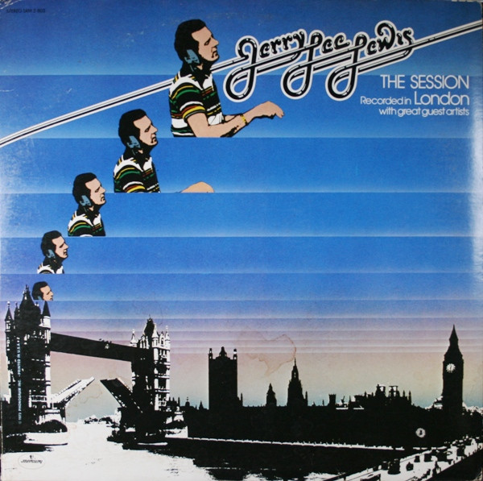

# The Session Recorded In London With Great Guest Artists

By Jerry Lee Lewis

## Album Data

[Discogs URL](https://www.discogs.com/release/6992755-Jerry-Lee-Lewis-The-Session-Recorded-In-London-With-Great-Guest-Artists)

- Label: Mercury
Mercury
- Formats: Vinyl, LP, Album, Stereo
- Genres: Rock, Blues, Rock & Roll, Blues Rock
- Rating: 3.97
- Released: 1973
- Year: 1973
- Release ID: 6992755
- Media condition: 
- Sleeve condition: 
- Speed: 
- Weight: 
- Notes: 

## Album Tracks

| **Position** | **Title** | **Duration** |
|--------------|-----------|--------------|
| A1 | **Drinking Wine Spo-Dee O'Dee** | 3:37 |
| A2 | **Music To The Man** | 4:40 |
| A3 | **Baby What You Want Me To Do** | 3:58 |
| A4 | **Bad Moon Rising** | 2:37 |
| A5 | **Sea Cruise** | 3:53 |
| B1 | **Jukebox** | 4:38 |
| B2 | **No Headstone On My Grave** | 5:21 |
| B3 | **Big Boss Man** | 3:42 |
| B4 | **Pledging My Love** | 2:23 |
| B5 | **Memphis** | 4:03 |
| C1 | **Trouble In Mind** | 5:48 |
| C2 | **Johnny B. Goode** | 3:30 |
| C3 | **High School Confidential (Tribute To Jerry Lee - Instrumental)** | 3:27 |
| C4 | **Early Morning Rain** | 4:21 |
| D1 | **Whole Lot Of Shakin' Goin' On** | 4:00 |
| D2 | **Sixty-Minute Man** | 3:36 |
| D3 | **Movin' On Down The Line** | 3:28 |
| D4 | **What'd I Say** | 4:58 |
|  | **Rock & Roll Medley** | 3:50 |

## Artist Roles

| **Name** | **Role** |
|----------|----------|
| **Robin McBride** | A&R |
| **Jim Ladwig** | Art Direction |
| **John Youssi** | Design |
| **Martin Rushent** | Engineer |
| **Geoff Young** | Engineer [Asst. Eng.] |
| **John Bromley** | Engineer [Asst. Eng.] |
| **Paul Hardiman** | Engineer [Asst. Eng.] |
| **Charles Fach** | Executive-Producer |
| **Gilbert Kong** | Lacquer Cut By |
| **Joe Sundwall** | Lettering |
| **Gilbert Kong** | Mastered By |
| **Barrie Wentzell** | Photography By |
| **Steve Rowland** | Producer |
| **Jerry Lee Lewis** | Vocals, Electric Piano |
| **Jerry Lee Lewis** | Vocals, Piano |

