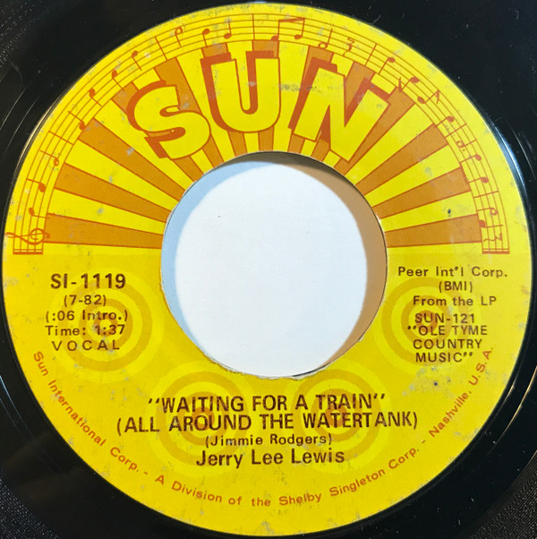

# Waiting For A Train (All Around The Watertank)

By Jerry Lee Lewis

## Album Data

[Discogs URL](https://www.discogs.com/release/6130443-Jerry-Lee-Lewis-Waiting-For-A-Train-All-Around-The-Watertank)

- Label: Sun (9)
- Formats: Vinyl, 7", 45 RPM, Single, Promo
- Genres: Rock, Folk, World, & Country, Country Rock, Country, Rock & Roll
- Rating: 3
- Released: 1970
- Year: 1970
- Release ID: 6130443
- Media condition: 
- Sleeve condition: 
- Speed: 
- Weight: 
- Notes: 

## Album Tracks

| **Position** | **Title** | **Duration** |
|--------------|-----------|--------------|
| A | **Waiting For A Train (All Around The Watertank) (Stereo)** | 1:37 |
| B | **Waiting For A Train (All Around The Watertank) (Mono)** | 1:37 |

