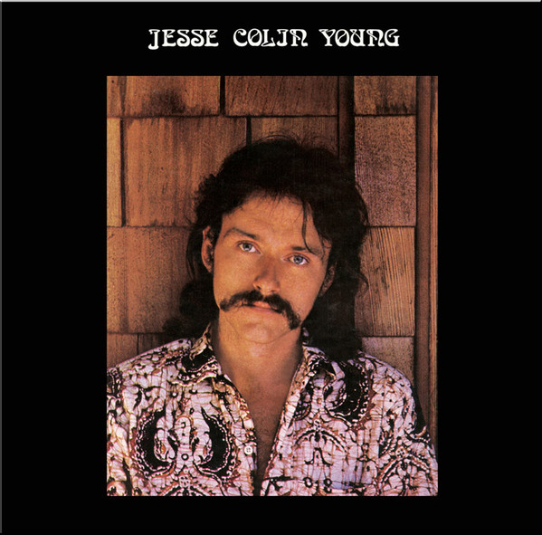

# Song For Juli

By Jesse Colin Young

## Album Data

[Discogs URL](https://www.discogs.com/release/9714003-Jesse-Colin-Young-Song-For-Juli)

- Label: Pigfoot Music
- Formats: Vinyl, LP, Album, Remastered
- Genres: Rock, Folk Rock
- Rating: 4.2
- Released: 2016
- Year: 1973
- Release ID: 9714003
- Media condition: 
- Sleeve condition: 
- Speed: 
- Weight: 
- Notes: 

## Album Tracks

| **Position** | **Title** | **Duration** |
|--------------|-----------|--------------|
| A1 | **Morning Sun** | 4:01 |
| A2 | **Song For Juli** | 4:57 |
| A3 | **Ridgetop** | 7:02 |
| A4 | **Evenin'** | 3:11 |
| B1 | **Miss Hesitation** | 6:26 |
| B2 | **T-Bone Shuffle** | 5:01 |
| B3a | **Lafayette Waltz** | 5:02 |
| B3b | **Jambalaya (On The Bayou)** |  |
| B4 | **Country Home** | 4:00 |

## Artist Roles

| **Name** | **Role** |
|----------|----------|
| **Mel Martin** | Arranged By [Horns], Soprano Saxophone, Tenor Saxophone, Baritone Saxophone |
| **Sidney Wasserbach** | Design [Album], Photography By |
| **Jeffrey Myer** | Drums |
| **Eddie Ottenstein** | Guitar |
| **Richard Earthquake Anderson** | Harmonica |
| **David Hayes** | Harmony Vocals |
| **Jesse Colin Young** | Harmony Vocals |
| **Suzi Young** | Harmony Vocals |
| **Jon Sievert** | Photography By [Lyric Sheet] |
| **Scott Lawrence** | Piano, Vibraphone |
| **Cameron Henry (2)** | Remastered By |
| **Jim Rothermel** | Soprano Saxophone, Alto Saxophone, Flute, Clarinet |
| **Bob Ferreira** | Tenor Saxophone |
| **Gordon Messick** | Trombone |
| **Pat O'Hara** | Trombone |
| **Tom Harrell** | Trumpet |
| **John Tenney** | Violin |
| **Jesse Colin Young** | Vocals, Guitar |
| **Jesse Colin Young** | Written-By |

