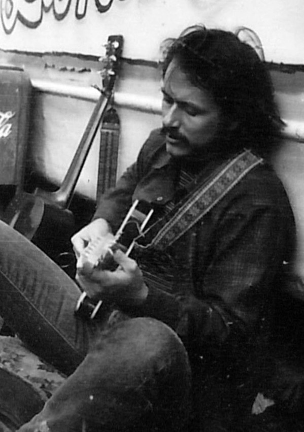

# Jesse Colin Young

## Artist Profile

American guitarist, bassist, singer, and songwriter. 

Born: 22 November 1941 in Queens, New York City, New York, USA. 

Founding member of the band The Youngbloods. 

## Artist Links

- [http://www.jessecolinyoung.com](http://www.jessecolinyoung.com)
- [https://www.facebook.com/jessecolinyoung/](https://www.facebook.com/jessecolinyoung/)
- [http://www.allmusic.com/artist/p14776](http://www.allmusic.com/artist/p14776)
- [http://en.wikipedia.org/wiki/Jesse_Colin_Young](http://en.wikipedia.org/wiki/Jesse_Colin_Young)

## See also

- [Song For Juli](Song_For_Juli.md)
