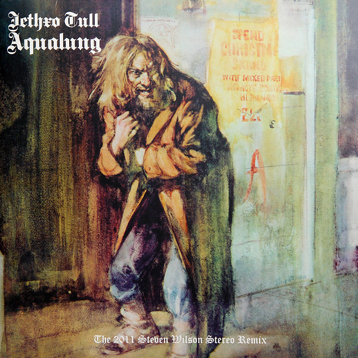

# Aqualung (The 2011 Steven Wilson Stereo Remix)

By Jethro Tull

## Album Data

[Discogs URL](https://www.discogs.com/release/7041910-Jethro-Tull-Aqualung-The-2011-Steven-Wilson-Stereo-Remix)

- Label: Chrysalis
Chrysalis
- Formats: Vinyl, LP, Album, Reissue, Repress, Stereo
- Genres: Rock, Classic Rock, Prog Rock, Folk Rock
- Rating: 4.74
- Released: 2015-05-25
- Year: 1971
- Release ID: 7041910
- Media condition: 
- Sleeve condition: 
- Speed: 
- Weight: 
- Notes: 

## Album Tracks

| **Position** | **Title** | **Duration** |
|--------------|-----------|--------------|
|  | **Aqualung** |  |
| A1 | **Aqualung** |  |
| A2 | **Cross-Eyed Mary** |  |
| A3 | **Cheap Day Return** |  |
| A4 | **Mother Goose** |  |
| A5 | **Wond'ring Aloud** |  |
| A6 | **Up To Me** |  |
|  | **My God** |  |
| B1 | **My God** |  |
| B2 | **Hymn 43** |  |
| B3 | **Slipstream** |  |
| B4 | **Locomotive Breath** |  |
| B5 | **Wind-Up** |  |

## Artist Roles

| **Name** | **Role** |
|----------|----------|
| **David Palmer (2)** | Arranged By [Orchestra Arranged By], Conductor [Orchestra Conducted By] |
| **Jeffrey Hammond-Hammond** | Bass Guitar, Alto Recorder, Voice [Odd Voices] |
| **Darren Evans (2)** | Design |
| **Clive Bunker** | Drums [A Thousand Drums], Percussion |
| **Martin Barre** | Electric Guitar, Recorder [Descant Recorder] |
| **John Burns** | Engineer |
| **Ian Anderson** | Flute, Acoustic Guitar, Voice |
| **John Burns** | Interviewee [Q & A] |
| **CCS (2)** | Layout [Original Layout By] |
| **Steven Wilson** | Liner Notes |
| **Dom Lawson** | Liner Notes, Interviewer [Interviews] |
| **Helen Owens** | Management [Marketing By] |
| **Peter Mew** | Mastered By [Mastering By] |
| **Steven Wilson** | Mixed By [New Stereo Mixes By] |
| **Burton Silverman** | Painting [Paintings By] |
| **Barry Plummer** | Photography By |
| **Bubi Heilemann** | Photography By |
| **Michael Putland** | Photography By |
| **Norbert Unfried** | Photography By |
| **John Evan** | Piano, Organ, Mellotron |
| **Ian Anderson** | Producer [Produced By] |
| **Terry Ellis** | Producer [Produced By] |
| **Don Needham** | Research [Additional Research By] |
| **Tim Chacksfield** | Research [Project Research], Coordinator [Project Co-ordination] |
| **Kris Burton** | Transferred By [Muti Track Transfers By] |
| **Ian Anderson** | Written-By |

