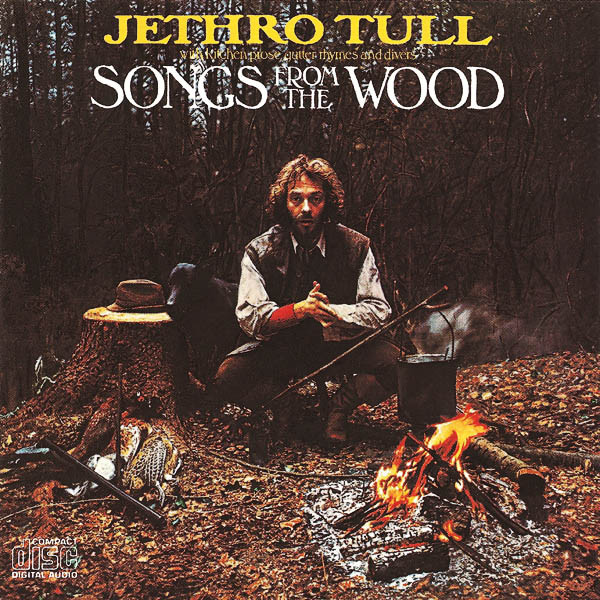

# Songs From The Wood

By Jethro Tull

## Album Data

[Discogs URL](https://www.discogs.com/release/6711538-Jethro-Tull-Songs-From-The-Wood)

- Label: Chrysalis
- Formats: Vinyl, LP, Album
- Genres: Rock, Folk Rock, Prog Rock, Classic Rock
- Rating: 4.23
- Released: 1977
- Year: 1977
- Release ID: 6711538
- Media condition: 
- Sleeve condition: 
- Speed: 
- Weight: 
- Notes: 

## Album Tracks

| **Position** | **Title** | **Duration** |
|--------------|-----------|--------------|
| A1 | **Songs From The Wood** | 4:52 |
| A2 | **Jack-In-The-Green** | 2:27 |
| A3 | **Cup Of Wonder** | 4:30 |
| A4 | **Hunting Girl** | 5:11 |
| A5 | **Ring Out, Solstice Bells** | 3:46 |
| B1 | **Velvet Green** | 6:03 |
| B2 | **The Whistler** | 3:30 |
| B3 | **Pibroch (Cap In Hand)** | 8:37 |
| B4 | **Fire At Midnight** | 2:26 |

## Artist Roles

| **Name** | **Role** |
|----------|----------|
| **Jethro Tull** | Arranged By |
| **Shirtsleeve Studio** | Artwork [Back Cover] |
| **Jay L. Lee** | Artwork [Front Cover Painting] |
| **John Glascock** | Bass, Vocals |
| **Barriemore Barlow** | Drums, Marimba, Glockenspiel, Bells, Percussion [Nakers And Tabor] |
| **Keith Howard** | Effects [Wood-cutter] |
| **Robin Black** | Engineer |
| **Thing Moss** | Engineer [Assistant] |
| **Trevor White (3)** | Engineer [Assistant] |
| **Martin Barre** | Guitar, Lute, Other [Additional Material] |
| **John Evan** | Piano, Organ, Synthesizer |
| **David Palmer (2)** | Piano, Synthesizer, Organ [Portative], Other [Additional Material] |
| **Ian Anderson** | Vocals, Flute, Acoustic Guitar, Mandolin, Whistle, Producer, Written-By |

