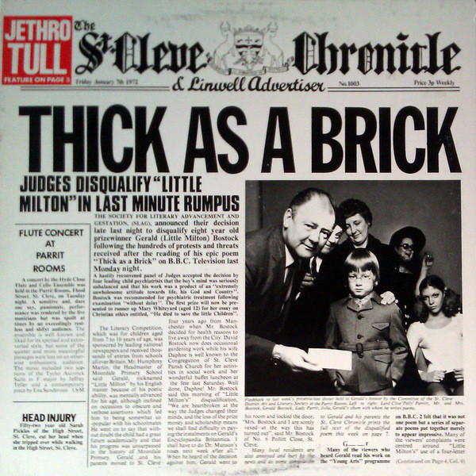

# Thick As A Brick

By Jethro Tull

## Album Data

[Discogs URL](https://www.discogs.com/release/7190621-Jethro-Tull-Thick-As-A-Brick)

- Label: Chrysalis
- Formats: Vinyl, LP, Album, Reissue
- Genres: Rock, Prog Rock, Folk Rock
- Rating: 4.68
- Released: 2015-06-29
- Year: 1972
- Release ID: 7190621
- Media condition: 
- Sleeve condition: 
- Speed: 
- Weight: 
- Notes: 

## Album Tracks

| **Position** | **Title** | **Duration** |
|--------------|-----------|--------------|
| A | **Thick As A Brick** |  |
| B | **Thick As A Brick** |  |

## Artist Roles

| **Name** | **Role** |
|----------|----------|
| **Steve Davis (15)** | Advisor [Project Advisor] |
| **Jethro Tull** | Arranged By, Performer [Performed By] |
| **CCS (2)** | Artwork [Original 'Newspaper' Artwork By] |
| **Darren Evans (2)** | Design [40th Anniversary Package Design By] |
| **Eric Brooks (4)** | Interviewee |
| **Ian Anderson** | Interviewee |
| **Jeffrey Hammond-Hammond** | Interviewee |
| **Martin Barre** | Interviewee |
| **Robin Black** | Liner Notes [Booklet p. 20] |
| **Dom Lawson** | Liner Notes [TAAB Article By] |
| **Helen Owens** | Management [Marketing By] |
| **Peter Mew** | Mastered By [Mastering By] |
| **Steven Wilson** | Mixed By [New Stereo Mix By] |
| **Didi Zill** | Photography By |
| **Robert Ellis (4)** | Photography By |
| **Robin Black** | Recorded By [Original Recording] |
| **Don Needham** | Research [Additional Research By] |
| **Tim Chacksfield** | Research, Coordinator [Project Co-ordination] |
| **Gerald Bostock** | Written-By |
| **Ian Anderson** | Written-By, Producer [Produced By] |

