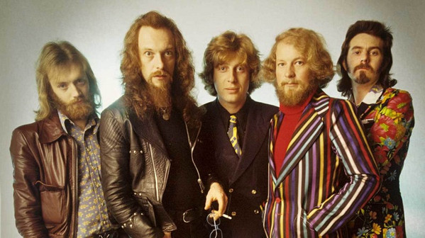

# Jethro Tull

## Artist Profile

Jethro Tull is a Grammy Award winning British rock group that was formed in 1967-1968. The group's music is marked by the distinctive vocal style and lead flute work of front man Ian Anderson. Initially playing blues rock with an experimental flavour, the band has, over the years, incorporated elements of classical, folk and 'ethnic' musics, jazz and art rock.

## Artist Links

- [https://jethrotull.com/](https://jethrotull.com/)
- [https://www.facebook.com/officialjethrotull/](https://www.facebook.com/officialjethrotull/)
- [https://twitter.com/jethrotull](https://twitter.com/jethrotull)
- [https://www.youtube.com/channel/UCyZe0Uc78q7aEA7bFKtZ-oA](https://www.youtube.com/channel/UCyZe0Uc78q7aEA7bFKtZ-oA)
- [https://www.youtube.com/channel/UC920MdLghXzI3oXHhlp7N1w](https://www.youtube.com/channel/UC920MdLghXzI3oXHhlp7N1w)
- [https://soundcloud.com/ia-taab2](https://soundcloud.com/ia-taab2)
- [https://instagram.com/jethrotull_](https://instagram.com/jethrotull_)
- [https://www.collecting-tull.com/](https://www.collecting-tull.com/)
- [http://www.progarchives.com/artist.asp?id=418](http://www.progarchives.com/artist.asp?id=418)
- [https://en.wikipedia.org/wiki/Jethro_Tull_(band)](https://en.wikipedia.org/wiki/Jethro_Tull_(band))
- [https://www.imdb.com/name/nm1432618/](https://www.imdb.com/name/nm1432618/)

## See also

- [Aqualung (The 2011 Steven Wilson Stereo Remix)](Aqualung_The_2011_Steven_Wilson_Stereo_Remix.md)
- [Minstrel In The Gallery (40th Anniversary LP Édition)](Minstrel_In_The_Gallery_40th_Anniversary_LP_Édition.md)
- [Songs From The Wood](Songs_From_The_Wood.md)
- [Thick As A Brick](Thick_As_A_Brick.md)
