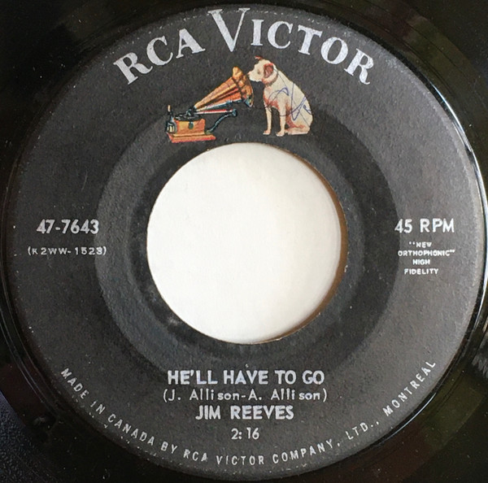

# He'll Have To Go / In A Mansion Stands My Love

By Jim Reeves

## Album Data

[Discogs URL](https://www.discogs.com/release/4699038-Jim-Reeves-Hell-Have-To-Go-In-A-Mansion-Stands-My-Love)

- Label: RCA Victor
- Formats: Vinyl, 7", Single, 45 RPM
- Genres: Pop, Folk, World, & Country, Country, Vocal
- Rating: 4
- Released: 1959
- Year: 1959
- Release ID: 4699038
- Media condition: 
- Sleeve condition: 
- Speed: 
- Weight: 
- Notes: 

## Album Tracks

| **Position** | **Title** | **Duration** |
|--------------|-----------|--------------|
| A | **He'll Have To Go** | 2:16 |
| B | **In A Mansion Stands My Love** | 2:14 |

