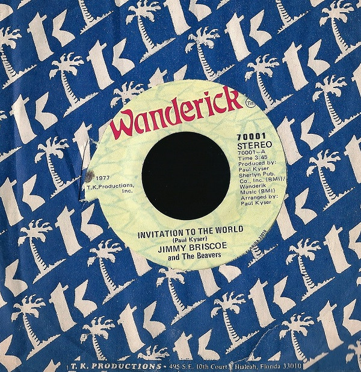

# Invitation To The World / Ain't Nothing New Under The Sun

By Jimmy Briscoe And The Beavers

## Album Data

[Discogs URL](https://www.discogs.com/release/2483286-Jimmy-Briscoe-And-The-Beavers-Invitation-To-The-World-Aint-Nothing-New-Under-The-Sun)

- Label: Wanderick
- Formats: Vinyl, 7"
- Genres: Funk / Soul, Soul, Disco
- Rating: 4.4
- Released: 1977
- Year: 1977
- Release ID: 2483286
- Media condition: 
- Sleeve condition: 
- Speed: 
- Weight: 
- Notes: 

## Album Tracks

| **Position** | **Title** | **Duration** |
|--------------|-----------|--------------|
| A | **Invitation To The World** | 3:45 |
| B | **Ain't Nothing New Under The Sun** | 4:04 |

## Artist Roles

| **Name** | **Role** |
|----------|----------|
| **Paul Kyser** | Producer, Arranged By |

