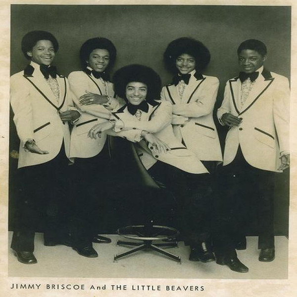

# Jimmy Briscoe And The Beavers

## Artist Profile

Soul - disco group

Formed in 1971, Baltimore, Maryland
Discovered by Paul Kyser
They recorded a number of singles, starting with a cover of Frankie Lymon &amp; The Teenagers' "Why Do Fools Fall in Love".
In 1974 they released their first album at Pi Kappa Records.
Members: Jimmy Briscoe, Stanford Stansberry, Kevin Barnes, Maurice Pulley, Bobby Finch
Bobby Finch replaced Robert Makins in 1977 and the group became Jimmy Briscoe And The Beavers. 
Recorded one more album at Wanderick.
Disbanded in 1979.

## Artist Links

- [http://en.wikipedia.org/wiki/Jimmy_Briscoe_%26_The_Little_Beavers](http://en.wikipedia.org/wiki/Jimmy_Briscoe_%26_The_Little_Beavers)

## See also

- [Invitation To The World / Ain't Nothing New Under The Sun](Invitation_To_The_World_-_Aint_Nothing_New_Under_The_Sun.md)
