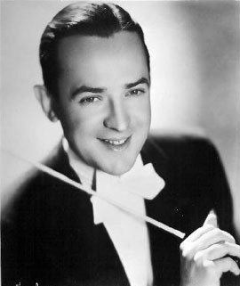

# Jimmy Dorsey

## Artist Profile

Saxophonist, clarinetist and trumpet player, (born February 29, 1904, Shenandoah, Pennsylvania, USA – died June 12, 1957, New York City, New York, USA), he often played with his brother Tommy Dorsey and helped the Swing Jazz Era grow in New York. He died just months after his brother, both during their sleep.

## Artist Links

- [http://en.wikipedia.org/wiki/Jimmy_Dorsey](http://en.wikipedia.org/wiki/Jimmy_Dorsey)
- [https://www.britannica.com/biography/Jimmy-Dorsey](https://www.britannica.com/biography/Jimmy-Dorsey)
- [https://www.allmusic.com/artist/jimmy-dorsey-mn0000296745/biography](https://www.allmusic.com/artist/jimmy-dorsey-mn0000296745/biography)
- [https://www.imdb.com/name/nm0234153/](https://www.imdb.com/name/nm0234153/)
- [https://adp.library.ucsb.edu/index.php/mastertalent/detail/323516/Jimmy_Dorsey_Orchestra](https://adp.library.ucsb.edu/index.php/mastertalent/detail/323516/Jimmy_Dorsey_Orchestra)

## See also

- [June Night](June_Night.md)
