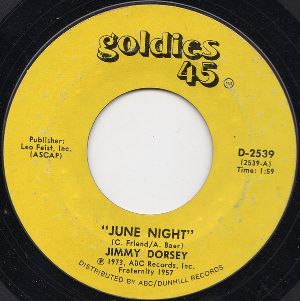

# June Night

By Jimmy Dorsey

## Album Data

[Discogs URL](https://www.discogs.com/release/9719036-Jimmy-Dorsey-June-Night)

- Label: Goldies 45
- Formats: Vinyl, 7", 45 RPM, Single, Reissue
- Genres: Jazz, Swing
- Rating: 0
- Released: 1973
- Year: 1973
- Release ID: 9719036
- Media condition: 
- Sleeve condition: 
- Speed: 
- Weight: 
- Notes: 

## Album Tracks

| **Position** | **Title** | **Duration** |
|--------------|-----------|--------------|
| A | **June Night** | 1:59 |
| B | **Jay Dee's Boogie** | 2:33 |

