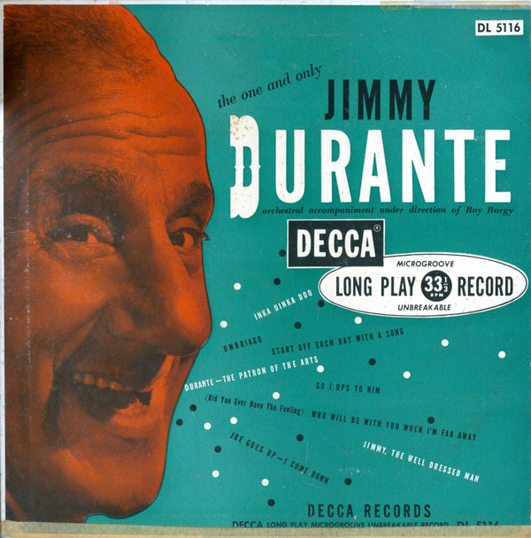

# The One And Only

By Jimmy Durante

## Album Data

[Discogs URL](https://www.discogs.com/release/3782723-Jimmy-Durante-The-One-And-Only)

- Label: Decca
- Formats: Vinyl, LP, 10", Compilation
- Genres: Pop
- Rating: 4.33
- Released: 1949
- Year: 1946
- Release ID: 3782723
- Media condition: 
- Sleeve condition: 
- Speed: 
- Weight: 
- Notes: 

## Album Tracks

| **Position** | **Title** | **Duration** |
|--------------|-----------|--------------|
| A1 | **Inka Dinka Doo** |  |
| A2 | **Umbriago** |  |
| A3 | **Start Off Each Day With A Song** |  |
| A4 | **Durante - The Patron Of The Arts** |  |
| B1 | **Who Will Be With You When I'm Far Away** |  |
| B2 | **So I UPS To Him** |  |
| B3 | **Jimmy, The Well Dressed Man** |  |
| B4 | **Joe Goes Up - I Come Down** |  |

