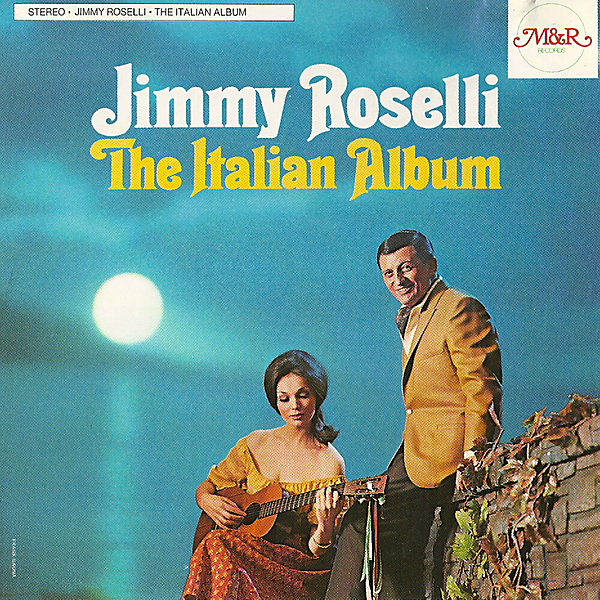

# Don't Cry, Little Girl, Don't Cry

By Jimmy Roselli

## Album Data

[Discogs URL](https://www.discogs.com/release/8917418-Jimmy-Roselli-Dont-Cry-Little-Girl-Dont-Cry)

- Label: Recording Industries Corp.
- Formats: Vinyl, 7", 45 RPM, Single
- Genres: Pop, Vocal
- Rating: 0
- Released: 1965
- Year: 1965
- Release ID: 8917418
- Media condition: 
- Sleeve condition: 
- Speed: 
- Weight: 
- Notes: 

## Album Tracks

| **Position** | **Title** | **Duration** |
|--------------|-----------|--------------|
| A | **Don't Cry, Little Girl, Don't Cry** | 2:12 |
| B | **Just Say I Love Her** | 2:35 |

## Artist Roles

| **Name** | **Role** |
|----------|----------|
| **Ralph Burns** | Conductor |
| **Jimmy Roselli** | Producer |

