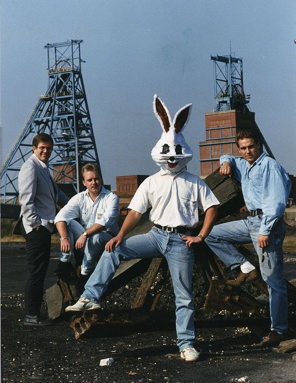

# Jive Bunny And The Mastermixers

## Artist Profile

Jive Bunny And The Mastermixers were a novelty pop music act from Rotherham, Yorkshire, England. The face of the group was Jive Bunny, a cartoon rabbit who appeared in the videos, and also (as a human being in a costume) did promotional appearances for them.

## Artist Links

- [https://www.jivebunny.com/](https://www.jivebunny.com/)
- [https://en.wikipedia.org/wiki/Jive_Bunny_and_the_Mastermixers](https://en.wikipedia.org/wiki/Jive_Bunny_and_the_Mastermixers)

## See also

- [Swing The Mood](Swing_The_Mood.md)
