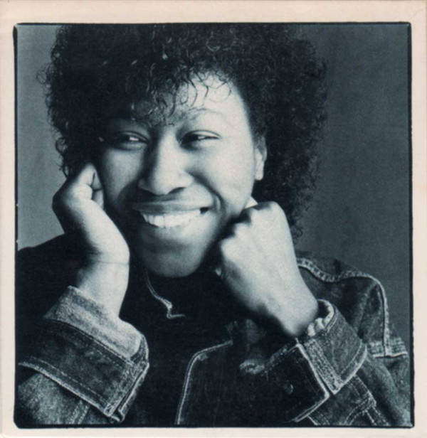

# Joan Armatrading

By Joan Armatrading

## Album Data

[Discogs URL](https://www.discogs.com/release/8248373-Joan-Armatrading-Joan-Armatrading)

- Label: A&M Records
- Formats: Vinyl, LP, Album, Stereo
- Genres: Rock, Folk Rock
- Rating: 4
- Released: 1976
- Year: 1976
- Release ID: 8248373
- Media condition: 
- Sleeve condition: 
- Speed: 
- Weight: 
- Notes: 

## Album Tracks

| **Position** | **Title** | **Duration** |
|--------------|-----------|--------------|
| A1 | **Down To Zero** | 3:49 |
| A2 | **Help Yourself** | 4:03 |
| A3 | **Water With The Wine** | 2:48 |
| A4 | **Love And Affection** | 4:28 |
| A5 | **Save Me** | 3:37 |
| B1 | **Join The Boys** | 4:49 |
| B2 | **People** | 3:29 |
| B3 | **Somebody Who Loves You** | 3:34 |
| B4 | **Like Fire** | 5:11 |
| B5 | **Tall In The Saddle** | 5:45 |

## Artist Roles

| **Name** | **Role** |
|----------|----------|
| **Fabio Nicoli** | Art Direction |
| **Nick Marshall (7)** | Design |
| **Clive Arrowsmith** | Photography By |
| **Glyn Johns** | Producer, Engineer |
| **Joan Armatrading** | Written-By |

