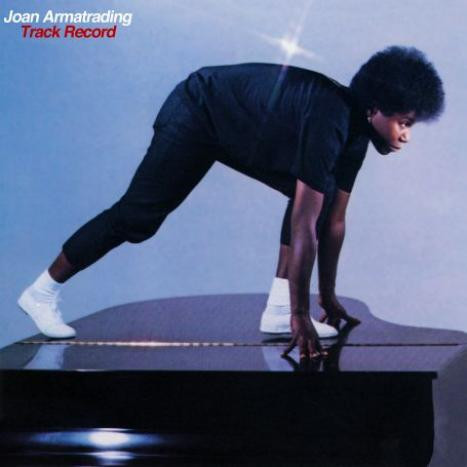

# Track Record

By Joan Armatrading

## Album Data

[Discogs URL](https://www.discogs.com/release/2171815-Joan-Armatrading-Track-Record)

- Label: A&M Records
- Formats: Vinyl, LP, Compilation
- Genres: Rock, Funk / Soul, Pop, Folk Rock, Soft Rock, Pop Rock, Soul
- Rating: 4.08
- Released: 1983
- Year: 1983
- Release ID: 2171815
- Media condition: 
- Sleeve condition: 
- Speed: 
- Weight: 
- Notes: 

## Album Tracks

| **Position** | **Title** | **Duration** |
|--------------|-----------|--------------|
| A1 | **Drop The Pilot** | 3:42 |
| A2 | **(I Love It When You) Call Me Names** | 3:24 |
| A3 | **Frustration** | 3:35 |
| A4 | **When I Get It Right** | 2:50 |
| A5 | **I'm Lucky** | 3:04 |
| A6 | **Me Myself I** | 3:16 |
| A7 | **The Weakness In Me** | 3:32 |
| B1 | **Heaven** | 4:40 |
| B2 | **Down To Zero** | 3:50 |
| B3 | **Love And Affection** | 4:27 |
| B4 | **Show Some Emotion** | 3:30 |
| B5 | **Willow** | 4:03 |
| B6 | **Rosie** | 3:10 |

## Artist Roles

| **Name** | **Role** |
|----------|----------|
| **Michael Ross (3)** | Design, Art Direction |
| **Glyn Johns** | Engineer |
| **Val Garay** | Engineer |
| **Frank DeLuna** | Lacquer Cut By [Runout Etching: (face with pointy ears)] |
| **Mike Noble (2)** | Management |
| **Running Dog Management** | Management |
| **Frank DeLuna** | Mastered By |
| **Moshe Brakha** | Photography By |
| **Glyn Johns** | Producer |
| **Joan Armatrading** | Producer |
| **Richard Gottehrer** | Producer |
| **Steve Lillywhite** | Producer |
| **Val Garay** | Producer |
| **Joan Armatrading** | Written-By |

