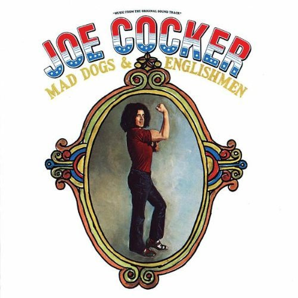

# Mad Dogs & Englishmen

By Joe Cocker

## Album Data

[Discogs URL](https://www.discogs.com/release/3339945-Joe-Cocker-Mad-Dogs-Englishmen)

- Label: Music On Vinyl
A&M Records
- Formats: Vinyl, LP, Album, Reissue
- Genres: Rock, Blues Rock, Classic Rock
- Rating: 4.56
- Released: 2011-09-22
- Year: 1970
- Release ID: 3339945
- Media condition: 
- Sleeve condition: 
- Speed: 
- Weight: 
- Notes: 

## Album Tracks

| **Position** | **Title** | **Duration** |
|--------------|-----------|--------------|
| A1 | **Introduction** | 0:45 |
| A2 | **Honky Tonk Woman** | 3:35 |
| A3 | **Introduction** | 0:10 |
| A4 | **Sticks And Stones** | 2:30 |
| A5 | **Cry Me A River** | 3:50 |
| A6 | **Bird On The Wire** | 6:15 |
| B1 | **Feelin´ Alright** | 5:30 |
| B2 | **Superstar** | 4:55 |
| B3 | **Introduction** | 0:15 |
| B4 | **Let´s Get Stoned** | 7:15 |
|  | **Blue Medley** | 12:47 |
| C2 | **Introduction** | 0:20 |
| C3 | **Girl From The North Country** | 2:30 |
| C4 | **Give Peace A Chance** | 4:20 |
| D1 | **Introduction** | 0:40 |
| D2 | **She Came In Thru The Bathroom Window** | 2:50 |
| D3 | **Space Captain** | 4:55 |
| D4 | **The Letter** | 4:20 |
| D5 | **Delta Lady** | 5:35 |

## Artist Roles

| **Name** | **Role** |
|----------|----------|
| **Chris Stainton** | Arranged By |
| **Leon Russell** | Arranged By |
| **Carl Radle** | Bass |
| **Bobby Jones (4)** | Choir |
| **Claudia Lennear** | Choir |
| **Daniel Moore** | Choir |
| **Don Preston (2)** | Choir |
| **Donna Washburn** | Choir |
| **Donna Weiss** | Choir |
| **Matthew Moore** | Choir |
| **Nickey Barclay** | Choir |
| **Pamela Polland** | Choir |
| **Rita Coolidge** | Choir |
| **Bobby Torres** | Congas |
| **Tom Wilkes (2)** | Design |
| **Craig Braun** | Design Concept [Packaging Concept] |
| **Chuck Blackwell** | Drums |
| **Jim Gordon** | Drums |
| **Jim Keltner** | Drums |
| **Eddie Kramer** | Engineer [Locaton] |
| **Leon Russell** | Guitar |
| **Ron Wolin** | Illustration |
| **John Mendelsohn** | Liner Notes |
| **Glyn Johns** | Mixed By, Mastered By |
| **Chris Stainton** | Organ |
| **Chuck Blackwell** | Percussion |
| **Sandy Konikoff** | Percussion |
| **Andee Cohen** | Photography By |
| **Jim McCrary** | Photography By |
| **Chris Stainton** | Piano |
| **Leon Russell** | Piano |
| **Denny Cordell** | Producer |
| **Leon Russell** | Producer |
| **Don Preston (2)** | Rhythm Guitar |
| **Bobby Keys** | Tenor Saxophone |
| **Jim Price** | Trumpet |

