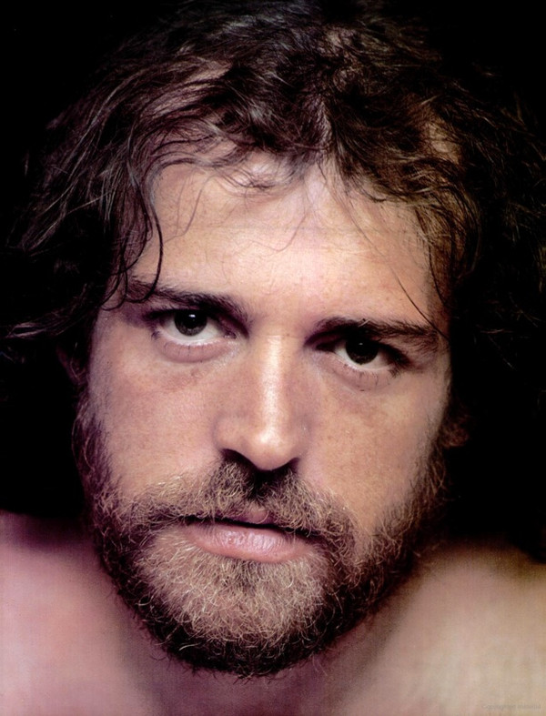

# Joe Cocker

## Artist Profile

English rock and blues singer.

Born: 20 May 1944 in Crookes, Sheffield, England, UK.
Died: 22 December 2014 at the "Mad Dog Ranch", Crawford, Colorado, US.

OBE - Officer of the Most Excellent Order of the British Empire.

The Grease Band. A British rock band that originally formed as Joe Cocker's backing group.

## Artist Links

- [https://www.cocker.com/](https://www.cocker.com/)
- [https://www.facebook.com/joecockerofficial](https://www.facebook.com/joecockerofficial)
- [https://en.wikipedia.org/wiki/Joe_Cocker](https://en.wikipedia.org/wiki/Joe_Cocker)
- [https://www.imdb.com/name/nm0168312/](https://www.imdb.com/name/nm0168312/)

## See also

- [Mad Dogs & Englishmen](Mad_Dogs_and_Englishmen.md)
