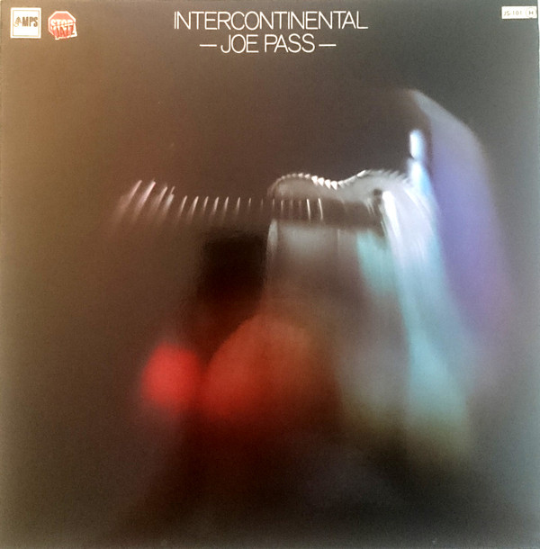

# Intercontinental

By Joe Pass

## Album Data

[Discogs URL](https://www.discogs.com/release/6513362-Joe-Pass-Intercontinental)

- Label: MPS Records
MPS Records
- Formats: Vinyl, LP, Album, Reissue, Remastered, Stereo
- Genres: Jazz, Bop
- Rating: 4.71
- Released: 2014
- Year: 1971
- Release ID: 6513362
- Media condition: 
- Sleeve condition: 
- Speed: 
- Weight: 
- Notes: 

## Album Tracks

| **Position** | **Title** | **Duration** |
|--------------|-----------|--------------|
| A1 | **Chloe** | 5:24 |
| A2 | **Meditacao** | 5:25 |
| A3 | **I Cover The Waterfront** | 4:15 |
| A4 | **I Love You** | 5:00 |
| A5 | **Stompin' At The Savoy** | 4:15 |
| B1 | **Watch What Happens** | 5:25 |
| B2 | **Joe's Blues** | 6:00 |
| B3 | **El Gento** | 4:03 |
| B4 | **Ode To Billy Joe** | 3:30 |
| B5 | **Li'l Darlin'** | 3:34 |

## Artist Roles

| **Name** | **Role** |
|----------|----------|
| **Eberhard Weber** | Bass |
| **Heinz Bähr (2)** | Design |
| **Kenny Clare** | Drums |
| **Rolf Donner** | Engineer [Recording Engineer] |
| **Joe Pass** | Guitar |
| **Heino Leja** | Lacquer Cut By |
| **Hubertus Mall** | Photography By [Cover Photo] |
| **German Hasenfratz** | Photography By [Inside Photos] |
| **Hans Georg Brunner-Schwer** | Producer [Produced By] |
| **Willi Fruth** | Recording Supervisor [Recording Director] |

