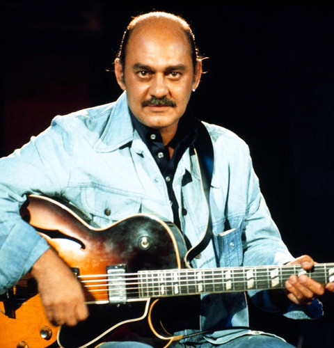

# Joe Pass

## Artist Profile

American jazz guitarist of Sicilian descent.
Born: January 13, 1929 in New Brunswick, New Jersey.
Died: May 23, 1994 in Los Angeles, California.
Although active as a player from the age of 14, it wasn't until the 1960s – following a long battle with, and eventual rehabilitation from drug addiction – that he began to establish himself as one of the very great jazz guitarists. A brilliant improviser, his early small group recordings featured fluent, bop-influenced, single note lines, coupled with a sophisticated harmonic sense and tremendous rhythmic drive and invention. In the 1970s he recorded the first of several solo performances in which he adopted a fingerstyle approach to playing rather than using a plectrum. As well as leading his own groups, he recorded with many of the great names of jazz, including Count Basie, Benny Carter, Zoot Sims, Milt Jackson, Duke Ellington and, notably, four classic albums with Ella Fitzgerald. The Ibanez company produced a 'Joe Pass' edition in their archtop jazz guitar range, and some years later, the Epiphone company manufactured a 'Joe Pass' version of their 'Emperor' jazz guitar.

## Artist Links

- [https://en.wikipedia.org/wiki/Joe_Pass](https://en.wikipedia.org/wiki/Joe_Pass)
- [http://www.asahi-net.or.jp/~UX5T-OOIS/](http://www.asahi-net.or.jp/~UX5T-OOIS/)
- [https://www.imdb.com/name/nm1601223/](https://www.imdb.com/name/nm1601223/)

## See also

- [Intercontinental](Intercontinental.md)
