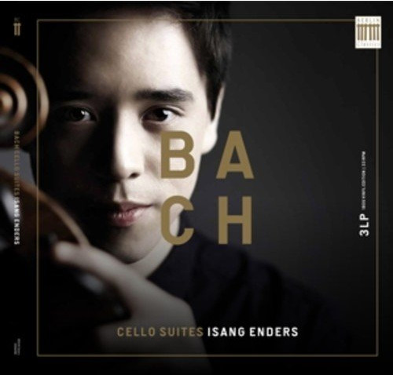

# Bach Cello Suites

By Johann Sebastian Bach

## Album Data

[Discogs URL](https://www.discogs.com/release/7494194-Bach-Isang-Enders-Bach-Cello-Suites)

- Label: Berlin Classics
- Formats: Vinyl, LP, Album
- Genres: Classical, Baroque
- Rating: 4.14
- Released: 2015-01-27
- Year: 2015
- Release ID: 7494194
- Media condition: 
- Sleeve condition: 
- Speed: 
- Weight: 
- Notes: 

## Album Tracks

| **Position** | **Title** | **Duration** |
|--------------|-----------|--------------|
| A | **Suite Nr. 5 C - Moll BWV 1011 / 995** |  |
| B | **Suite Nr. 2 D - Moll BWV 1008** |  |
| C | **Suite Nr. 4 Es - Dur BWV 1010** |  |
| D | **Suite Nr. 3 C - Dur BWV 1009** |  |
| E | **Suite Nr. 1 G - Dur BWV 1007** |  |
| F | **Suite Nr. 6 D - Dur BWV 1012** |  |

## Artist Roles

| **Name** | **Role** |
|----------|----------|
| **Johann Sebastian Bach** | Composed By |
| **Taeuk Kang** | Cover |
| **Daniel Enders** | Design |
| **Bernhard Güttler** | Producer [Recording] |
| **Isang Enders** | Violoncello |

