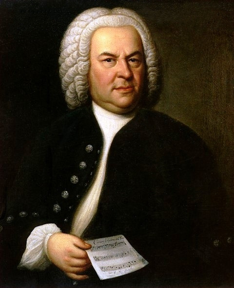

# Johann Sebastian Bach

## Artist Profile

Johann Sebastian Bach was born on March 21, 1685 in Eisenach, Thuringia, Germany. A prolific German composer and organist, his sacred and secular works for choir, orchestra and solo instruments drew together the strands of the baroque genre and brought it to its ultimate maturity. Although he introduced no new forms, he enriched the prevailing German style with a robust contrapuntal technique, a control of harmonic and motivic organisation from the smallest to the largest scales, and the adaptation of rhythms and textures from abroad, particularly Italy and France. Many people consider him to be the greatest Baroque composer, and one of the greatest composers of all time.

Revered for their intellectual depth, technical command and artistic beauty, J.S. Bach's works include the Brandenburg concertos, the keyboard suites and partitas, the Mass in B Minor, the St. Matthew Passion, The Musical Offering, The Art of Fugue and a large number of cantatas, of which about 220 survive. He died on July 28, 1750.

Some of his sons also became composers - Carl Philipp Emanuel Bach, Johann Christian Bach, Wilhelm Friedemann Bach and Johann Christoph Friedrich Bach.

## Artist Links

- [https://www.bach.de/](https://www.bach.de/)
- [https://en.wikipedia.org/wiki/Johann_Sebastian_Bach](https://en.wikipedia.org/wiki/Johann_Sebastian_Bach)
- [https://www.britannica.com/biography/Johann-Sebastian-Bach](https://www.britannica.com/biography/Johann-Sebastian-Bach)
- [https://www.klassika.info/Komponisten/Bach/index.html](https://www.klassika.info/Komponisten/Bach/index.html)
- [https://www.biography.com/musician/johann-sebastian-bach](https://www.biography.com/musician/johann-sebastian-bach)

## See also

- [Bach Cello Suites](Bach_Cello_Suites.md)
- [Violinkonzerte In A-moll Und E-Dur / Konzert Für Zwei Violinen In D-Moll](Violinkonzerte_In_A-moll_Und_E-Dur_-_Konzert_Für_Zwei_Violinen_In_D-Moll.md)
