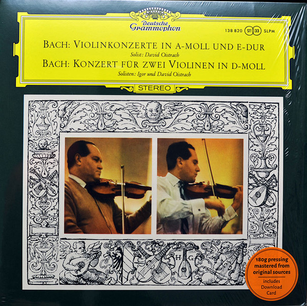

# Violinkonzerte In A-moll Und E-Dur / Konzert Für Zwei Violinen In D-Moll

By Johann Sebastian Bach

## Album Data

[Discogs URL](https://www.discogs.com/release/8326476-Bach-David-Oistrach-Igor-Oistrach-Violinkonzerte-In-A-moll-Und-E-Dur-Konzert-F%C3%BCr-Zwei-Violinen-In-D)

- Label: Deutsche Grammophon
Deutsche Grammophon
- Formats: Vinyl, LP, Album, Remastered
- Genres: Classical, Baroque
- Rating: 4.5
- Released: 2015
- Year: 1962
- Release ID: 8326476
- Media condition: 
- Sleeve condition: 
- Speed: 
- Weight: 
- Notes: 

## Album Tracks

| **Position** | **Title** | **Duration** |
|--------------|-----------|--------------|
|  | **Konzert Für Violine, Streicher Und Continuo Nr. 1 A-moll, BWV 1041** |  |
|  | **Konzert Für Violine, Streicher Und Continuo Nr. 2 E-dur, BWV 1042** |  |
|  | **Konzert Für 2 Violinen, Streicher Und Continuo D-moll, BWV 1043** |  |

## Artist Roles

| **Name** | **Role** |
|----------|----------|
| **Johann Sebastian Bach** | Composed By |
| **Sir Eugene Goossens** | Conductor |
| **David Oistrach** | Directed By [Leitung] |
| **Günter Hermanns** | Engineer [Toningenieur] |
| **Harald Baudis** | Engineer [Toningenieur] |
| **Georg Fischer** | Harpsichord |
| **George Malcolm** | Harpsichord |
| **The Royal Philharmonic Orchestra** | Orchestra |
| **Wiener Symphoniker** | Orchestra |
| **Erich Auerbach** | Photography By |
| **Hans Weber** | Recording Supervisor [Aufnahmeleiter] |
| **Wolfgang Lohse** | Recording Supervisor [Aufnahmeleiter] |
| **David Oistrach** | Violin, Soloist |
| **Igor Oistrach** | Violin, Soloist |

