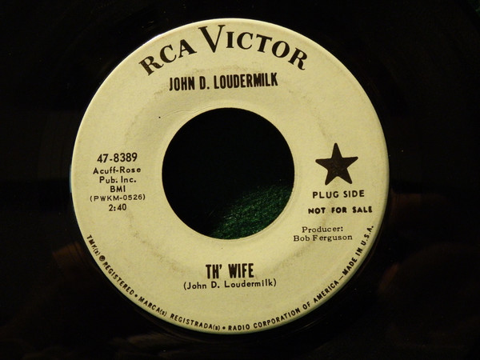

# Th' Wife

By John D. Loudermilk

## Album Data

[Discogs URL](https://www.discogs.com/release/9431833-John-D-Loudermilk-Th-Wife)

- Label: RCA Victor
- Formats: Vinyl, 7", 45 RPM, Single, Promo
- Genres: Rock, Pop, Rock & Roll
- Rating: 5
- Released: 1964-07-00
- Year: 1964
- Release ID: 9431833
- Media condition: 
- Sleeve condition: 
- Speed: 
- Weight: 
- Notes: 

## Album Tracks

| **Position** | **Title** | **Duration** |
|--------------|-----------|--------------|
| A | **Th' Wife** | 2:40 |
| B | **Nothing To Gain** | 2:28 |

## Artist Roles

| **Name** | **Role** |
|----------|----------|
| **Bob Ferguson** | Producer |

