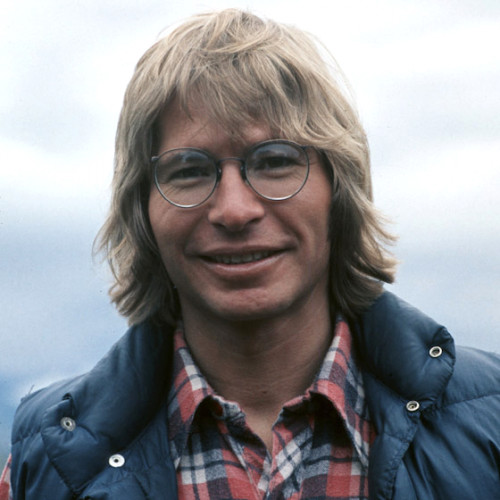

# John Denver

## Artist Profile

John Denver was one of the top five best-selling artists of all time with 14 gold and eight platinum albums in the United States and was popular around the world. John Denver began his career as a folk singer in The Mitchell Trio and Denver, Boise &amp; Johnson in the 1960s, before beginning his very successful solo country and pop career of the 1970s and 80s. John Denver was inducted into the Songwriters Hall of Fame in 1996.
Born December 31, 1943. in Roswell, New Mexico. 
Died at Pacific Grove, California on October 12, 1997, when the single-engine airplane he was piloting crashed into the sea. He was 53 years old.

## Artist Links

- [https://johndenver.com/](https://johndenver.com/)
- [https://www.facebook.com/JohnDenver/](https://www.facebook.com/JohnDenver/)
- [https://www.classicbands.com/denver.html](https://www.classicbands.com/denver.html)
- [https://en.wikipedia.org/wiki/John_Denver](https://en.wikipedia.org/wiki/John_Denver)
- [https://www.imdb.com/name/nm0000135/](https://www.imdb.com/name/nm0000135/)
- [https://www.songhall.org/profile/John_Denver](https://www.songhall.org/profile/John_Denver)

## See also

- [Sunshine On My Shoulders](Sunshine_On_My_Shoulders.md)
