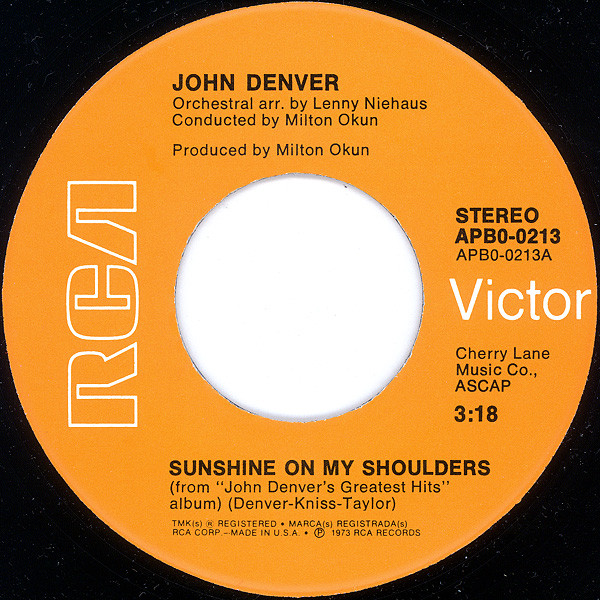

# Sunshine On My Shoulders

By John Denver

## Album Data

[Discogs URL](https://www.discogs.com/release/5434091-John-Denver-Sunshine-On-My-Shoulders)

- Label: RCA Victor
- Formats: Vinyl, 7", 45 RPM, Single, Stereo
- Genres: Folk, World, & Country, Country
- Rating: 4.08
- Released: 1974-01-00
- Year: 1974
- Release ID: 5434091
- Media condition: 
- Sleeve condition: 
- Speed: 
- Weight: 
- Notes: 

## Album Tracks

| **Position** | **Title** | **Duration** |
|--------------|-----------|--------------|
| A | **Sunshine On My Shoulders** | 3:18 |
| B | **Around And Around** | 2:16 |

## Artist Roles

| **Name** | **Role** |
|----------|----------|
| **Milton Okun** | Producer |

