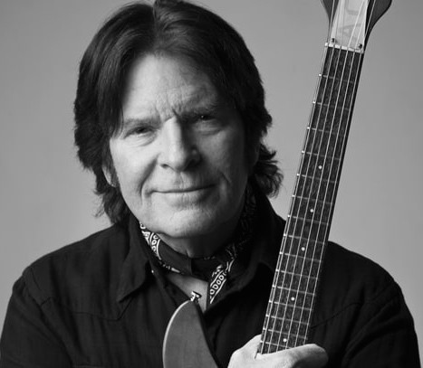

# John Fogerty

## Artist Profile

American musician, songwriter, and guitarist (born May 28, 1945, Berkeley, California, USA), best known as member of Creedence Clearwater Revival. Husband of Julie Fogerty, they married in Elkhart, Indiana, on April 20, 1991. Father of Shane Fogerty, Tyler Fogerty and Kelsy Fogerty.
In 1965 he formed The Golliwogs with his brother Tom Fogerty, Doug Clifford and Stu Cook.

## Artist Links

- [http://www.JohnFogerty.com](http://www.JohnFogerty.com)
- [http://www.MySpace.com/johnfogerty](http://www.MySpace.com/johnfogerty)
- [https://en.wikipedia.org/wiki/John_Fogerty](https://en.wikipedia.org/wiki/John_Fogerty)

## See also

- [Blue Moon Swamp](Blue_Moon_Swamp.md)
