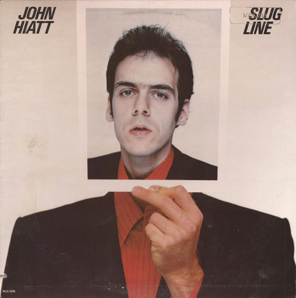

# Slug Line

By John Hiatt

## Album Data

[Discogs URL](https://www.discogs.com/release/7732037-John-Hiatt-Slug-Line)

- Label: MCA Records
- Formats: Vinyl, LP, Album
- Genres: Rock, Rock & Roll
- Rating: 3.67
- Released: 1979
- Year: 1979
- Release ID: 7732037
- Media condition: 
- Sleeve condition: 
- Speed: 
- Weight: 
- Notes: 

## Album Tracks

| **Position** | **Title** | **Duration** |
|--------------|-----------|--------------|
| A1 | **You Used To Kiss The Girls** | 2:31 |
| A2 | **The Negroes Were Dancing** | 2:45 |
| A3 | **Slug Line** | 2:59 |
| A4 | **Madonna Road** | 4:18 |
| A5 | **(No More) Dancin' In The Street** | 2:22 |
| A6 | **Long Night** | 5:18 |
| B1 | **The Night That Kenny Died** | 2:34 |
| B2 | **Radio Girl** | 2:54 |
| B3 | **You're My Love Interest** | 3:14 |
| B4 | **Take Off Your Uniform** | 4:06 |
| B5 | **Sharon's Got A Drugstore** | 2:10 |
| B6 | **Washable Ink** | 3:19 |

## Artist Roles

| **Name** | **Role** |
|----------|----------|
| **John Van Hamersveld** | Art Direction |
| **Etan McElroy** | Backing Vocals |
| **Jon Paris** | Bass |
| **Veyler Hildebrand** | Bass |
| **B.J. Wilson** | Drums |
| **Bruce Gary** | Drums |
| **Gerry Conway** | Drums |
| **Thom Mooney** | Drums |
| **Russ Gary** | Engineer |
| **Michael Carnevale** | Engineer [Second] |
| **John Hiatt** | Guitar |
| **Jon Paris** | Guitar |
| **Denny Bruce** | Management |
| **Nick Rozsa** | Photography By |
| **Etan McElroy** | Piano |
| **Todd Cochran** | Piano |
| **Denny Bruce** | Producer |
| **John Hiatt** | Vocals |
| **Jim Wismar** | Written-By |
| **John Hiatt** | Written-By |

