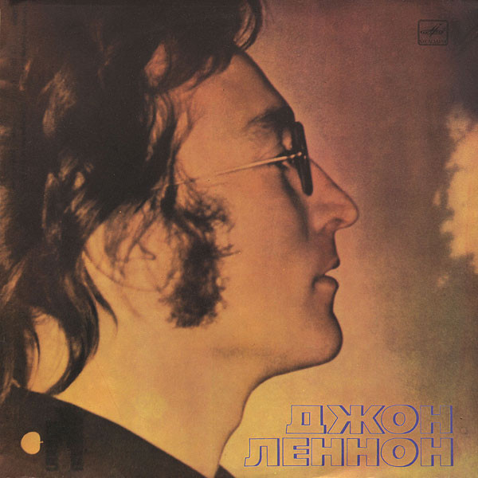

# Imagine

By John Lennon

## Album Data

[Discogs URL](https://www.discogs.com/release/7381085-John-Lennon-Imagine)

- Label: Apple Records
Apple Records
- Formats: Vinyl, LP, Album, Reissue, Remastered
- Genres: Rock, Pop Rock
- Rating: 4.57
- Released: 2015-08-21
- Year: 1971
- Release ID: 7381085
- Media condition: 
- Sleeve condition: 
- Speed: 
- Weight: 
- Notes: 

## Album Tracks

| **Position** | **Title** | **Duration** |
|--------------|-----------|--------------|
| A1 | **Imagine** | 2:59 |
| A2 | **Crippled Inside** | 3:43 |
| A3 | **Jealous Guy** | 4:10 |
| A4 | **It's So Hard** | 2:22 |
| A5 | **I Don't Want To Be A Soldier** | 6:01 |
| B1 | **Give Me Some Truth** | 3:11 |
| B2 | **Oh My Love** | 2:40 |
| B3 | **How Do You Sleep?** | 5:29 |
| B4 | **How?** | 3:37 |
| B5 | **Oh Yoko!** | 4:18 |

## Artist Roles

| **Name** | **Role** |
|----------|----------|
| **John Lennon** | Arranged By |
| **John Lennon & Yoko Ono** | Arranged By |
| **Yoko Ono** | Artwork [Whip And Mirror] |
| **Yoko Ono** | Cover [Cloud Piece On Cover] |
| **Yoko Ono** | Design [Cover Design], Photography By |
| **Eddie Beer** | Engineer [Ascot Sound Studios] |
| **Eddie Klein** | Engineer [Ascot Sound Studios] |
| **Eddie Veal** | Engineer [Ascot Sound Studios] |
| **Eddy Offord** | Engineer [Ascot Sound Studios] |
| **Phil McDonald** | Engineer [Ascot Sound Studios] |
| **Jack Douglas** | Engineer [Record Plant] |
| **Roy Cicala** | Engineer [Record Plant] |
| **Shelly Yakus** | Engineer [Record Plant] |
| **Allan Steckler** | Engineer [This And That At Record Plant] |
| **Arlene Reckson-Cohen** | Engineer [This And That At Record Plant] |
| **Tom Rabstenek** | Engineer [This And That At Record Plant] |
| **The Flux Fiddlers** | Featuring [With] |
| **Sean Magee** | Lacquer Cut By [Runout Etching i…i] |
| **Dan Richter** | Management [John & Yoko's Personal Assistant] |
| **Torrie Zito** | Orchestrated By [String Orchestrations] |
| **Val & Diana** | Other [Food By] |
| **Mal Evans & Peter Bendry** | Other [This & That] |
| **John Lennon** | Performer |
| **The Plastic Ono Band** | Performer |
| **John Lennon & Yoko Ono** | Producer |
| **Phil Spector** | Producer |
| **John Lennon** | Songwriter |
| **Yoko Ono** | Songwriter [Uncredited] |
| **George Maciunas** | Typography |
| **John Lennon** | Vocals [Uncredited] |

