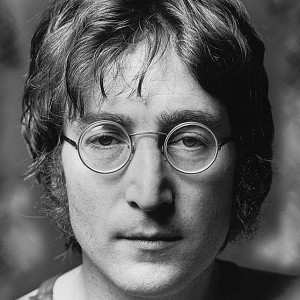

# John Lennon

## Artist Profile

Songwriter, rock singer and guitar player, best known for his work with The Beatles during the 1960s and 1970s. Inducted into Songwriters Hall of Fame in 1987. Inducted into Rock And Roll Hall Of Fame in 1994 (Performer).

Born: 9 October 1940 in Liverpool, Lancashire, UK. 
Died: 8 December 1980 in NYC, NY, USA.

John Winston Ono Lennon (MBE, gave it back) was an English singer, songwriter, and peace activist, who gained worldwide fame as the founder, co-lead vocalist, and rhythm guitarist of the Beatles. His songwriting partnership with Paul McCartney remains the most successful in musical history. In 1969, he started the Plastic Ono Band with his second wife, Yoko Ono (parents of Sean Lennon). After the Beatles disbanded in 1970, Lennon continued as a solo artist and as Ono's collaborator.

Born in Liverpool, Lennon became involved in the skiffle craze as a teenager. In 1956, he formed his first band, The Quarrymen, which evolved into the Beatles in 1960. He was initially the group's de facto leader, a role gradually ceded to McCartney. Lennon was characterized for the rebellious nature and acerbic wit in his music, writing, drawings, on film and in interviews. In 1957 Lennon meets his first wife Cynthia Lennon at the Liverpool College of Art and then married her on the 23rd of August, 1962. On the 8th of April, 1963, Cynthia gave birth to Lennon's first son, Julian Lennon. In the mid-1960s, he had two books published: In His Own Write and A Spaniard in the Works, both collections of nonsensical writings and line drawings. Starting with 1967s All You Need Is Love, his songs were adopted as anthems by the anti-war movement and the larger counterculture.

From 1968 to 1972, Lennon produced more than a dozen records with Ono, including a trilogy of avant-garde albums, his first solo LP John Lennon / Plastic Ono Band, and the international top 10 singles "Give Peace A Chance", "Instant Karma!", "Imagine" and "Happy Xmas (War Is Over) ". Controversial through his political and peace activism, after moving to New York City in 1971, his criticism of the Vietnam War resulted in a three-year attempt by the Nixon administration to deport him. In 1975, Lennon disengaged from the music business to raise his infant son Sean, and in 1980, returned with the Ono collaboration Double Fantasy. He was shot and killed in the archway of his Manhattan apartment building by a Beatles fan, Mark David Chapman, three weeks after the album's release. Lennon's ashes were scattered in New York's Central Park. A memorial was erected at the site of his ashes being scattered, named after a Beatles' song written by Lennon, "Strawberry Fields Forever."

## Artist Links

- [https://www.johnlennon.com/](https://www.johnlennon.com/)
- [https://www.facebook.com/johnlennon/](https://www.facebook.com/johnlennon/)
- [https://en.wikipedia.org/wiki/John_Lennon](https://en.wikipedia.org/wiki/John_Lennon)
- [https://www.songhall.org/profile/John_Lennon](https://www.songhall.org/profile/John_Lennon)

## See also

- [Imagine](Imagine.md)
- [Walls And Bridges](Walls_And_Bridges.md)
