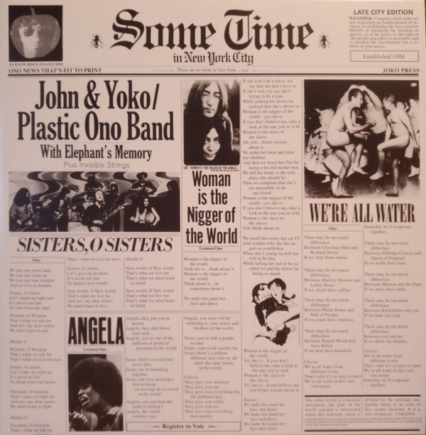

# Some Time In New York City

By John Lennon & Yoko Ono

## Album Data

[Discogs URL](https://www.discogs.com/release/7481319-John-Yoko-Plastic-Ono-Band-With-Elephants-Memory-And-Invisible-Strings-Some-Time-In-New-York-City)

- Label: Apple Records
- Formats: Vinyl, LP, Album, Reissue
- Genres: Rock, Rock & Roll, Art Rock, Noise, Avantgarde, Classic Rock
- Rating: 4.1
- Released: 2015
- Year: 1972
- Release ID: 7481319
- Media condition: 
- Sleeve condition: 
- Speed: 
- Weight: 
- Notes: 

## Album Tracks

| **Position** | **Title** | **Duration** |
|--------------|-----------|--------------|
|  | **Sometime In New York City** |  |
| A1 | **Woman Is The Nigger Of The World** |  |
| A2 | **Sisters O Sisters** |  |
| A3 | **Attica State** |  |
| A4 | **Born In A Prison** |  |
| A5 | **New York City** |  |
| B1 | **Sunday Bloody Sunday** |  |
| B2 | **The Luck Of The Irish** |  |
| B3 | **John Sinclair** |  |
| B4 | **Angela** |  |
| B5 | **We're All Water** |  |
|  | **Live Jam** |  |
| C1 | **Cold Turkey** | 7:43 |
| C2 | **Don't Worry Kyoko** | 17:20 |
| D1 | **Well (Baby, Please Don't Go)** | 4:50 |
| D2 | **Jamrag** | 1:50 |
| D3 | **Scumbag** | 13:10 |
| D4 | **Aü** | 3:25 |

## Artist Roles

| **Name** | **Role** |
|----------|----------|
| **John Lennon & Yoko Ono** | Arranged By |
| **Gary Van Scyoc** | Bass |
| **Klaus Voormann** | Bass [Base] |
| **Klaus Voormann** | Bass [Overdubbed] |
| **Jim Pons** | Bass, Vocals, Dialog |
| **Allan Steckler** | Cover [Live Jam LP New Cover] |
| **Cal Schenkel** | Cover [Live Jam LP Original Cover By] |
| **John Lennon & Yoko Ono** | Design Concept [Sleeve Concept] |
| **Michael Gross (10)** | Design [Sleeve Design] |
| **Alan White** | Drums |
| **Aynsley Dunbar** | Drums |
| **Jim Gordon** | Drums |
| **Keith Moon** | Drums |
| **Yoko Ono** | Drums |
| **Jim Keltner** | Drums, Percussion |
| **Rick Frank** | Drums, Percussion |
| **Nicky Hopkins** | Electric Piano |
| **Danny Turbeville** | Engineer |
| **Roy Cicala** | Engineer |
| **Roy Cicala** | Engineer |
| **Eric Clapton** | Guitar |
| **George Harrison** | Guitar |
| **Wayne "Tex" Gabriel** | Guitar |
| **Frank Zappa** | Guitar, Dialog |
| **Delaney Bramlett** | Guitar, Percussion |
| **Bob Harris (5)** | Keyboards [2nd], Vocals |
| **Sean Magee** | Lacquer Cut By [Runout Etching i…i] |
| **Ron Frangipane** | Orchestrated By [String Orchestration] |
| **Billy Preston** | Organ |
| **Delaney & Bonnie & Friends** | Percussion, Brass |
| **Yoko Ono** | Performer [Bag] |
| **Bob Gruen** | Photography By [Inside Left Cover] |
| **Joe Sia** | Photography By [Inside Right Cover] |
| **Adam Ippolito** | Piano, Organ |
| **John Lennon & Yoko Ono** | Producer |
| **Phil Spector** | Producer |
| **Bobby Keys** | Saxophone |
| **Stan Bronstein** | Saxophone, Flute |
| **Don Preston** | Synthesizer [Mini Moog] |
| **Jack Douglas** | Technician |
| **Yoko Ono** | Vocals |
| **Howard Kaylan** | Vocals, Dialog |
| **Mark Volman** | Vocals, Dialog |
| **John Lennon** | Vocals, Guitar, Other [National] |
| **Ian Underwood** | Woodwind, Keyboards, Vocals |

