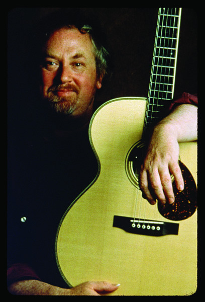

# John Renbourn

## Artist Profile

John Renbourn (born 8 August 1944, Marylebone, London, England; died 26 March 2015, Hawick, Scotland) was an English fingerstyle guitarist, singer and songwriter. He was known for his work in the group Pentangle, his solo recordings and his many collaborations with Stefan Grossman, Bert Jansch and Robin Williamson. Renbourn is usually categorized as a folk musician but he also recorded blues, early (medieval and renaissance) classical music and world music.

## Artist Links

- [http://www.john-renbourn.com](http://www.john-renbourn.com)
- [http://www.slipcue.com/music/international/celtic/artists/renbourn.html](http://www.slipcue.com/music/international/celtic/artists/renbourn.html)
- [http://en.wikipedia.org/wiki/John_Renbourn](http://en.wikipedia.org/wiki/John_Renbourn)

## See also

- [Sir John Alot Of Merrie Englandes Musyk Thyng & Ye Grene Knyghte](Sir_John_Alot_Of_Merrie_Englandes_Musyk_Thyng_and_Ye_Grene_Knyghte.md)
- [The Lady And The Unicorn](The_Lady_And_The_Unicorn.md)
