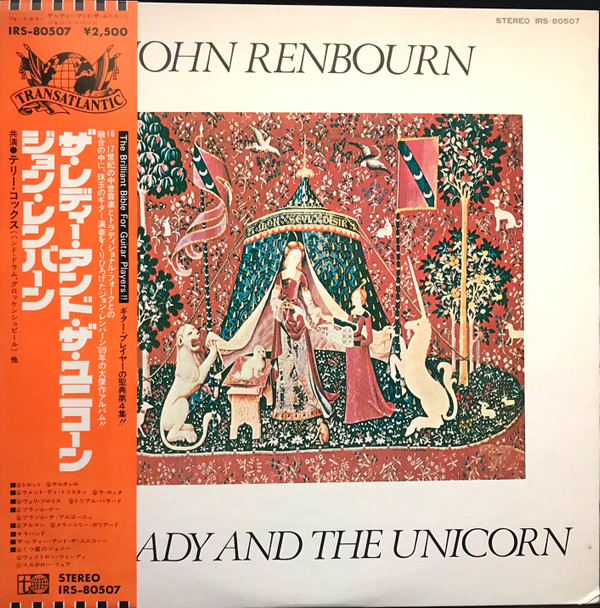

# The Lady And The Unicorn

By John Renbourn

## Album Data

[Discogs URL](https://www.discogs.com/release/1244172-John-Renbourn-The-Lady-And-The-Unicorn)

- Label: Reprise Records
- Formats: Vinyl, LP, Album, Repress
- Genres: Folk, World, & Country, Folk
- Rating: 3.94
- Released: 1975
- Year: 1970
- Release ID: 1244172
- Media condition: 
- Sleeve condition: 
- Speed: 
- Weight: 
- Notes: 

## Album Tracks

| **Position** | **Title** | **Duration** |
|--------------|-----------|--------------|
| A1.a | **Trotto** | 0:40 |
| A1.b | **Saltarrello** | 1:53 |
| A2.a | **Lamento Di Tristan** | 1:58 |
| A2.b | **La Rotta** | 0:55 |
| A3.a | **Veri Floris** | 0:44 |
| A3.b | **Triple Ballade** | 2:00 |
| A4.a | **Bransle Gay** | 1:13 |
| A4.b | **Bransle De Bourgoyne** | 1:34 |
| A5.a | **Alman** | 1:25 |
| A5.b | **Melancholy Galliard** | 2:47 |
| A6 | **Sarabande** | 2:41 |
| B1 | **The Lady And The Unicorn** | 3:21 |
| B2.a | **My Johnny Was A Shoemaker** | 4:16 |
| B2.b | **Western Wynde** | 1:25 |
| B2.c | **Scarborough Fair** | 7:22 |

## Artist Roles

| **Name** | **Role** |
|----------|----------|
| **Ray Warleigh** | Flute |
| **Tony Roberts** | Flute |
| **John Renbourn** | Guitar, Liner Notes |
| **Terry Cox** | Percussion |
| **Bill Leader** | Producer |
| **John Renbourn** | Sitar |
| **Don Harper (2)** | Viola |
| **Dave Swarbrick** | Violin |

