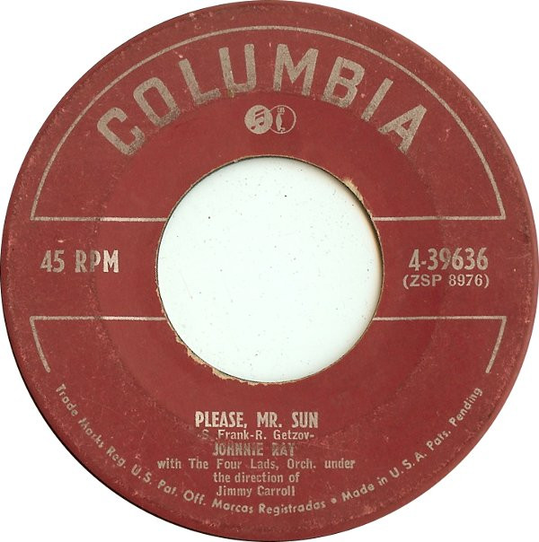

# Please, Mr. Sun / Here I Am - Broken Hearted

By Johnnie Ray

## Album Data

[Discogs URL](https://www.discogs.com/release/2512519-Johnnie-Ray-Please-Mr-Sun-Here-I-Am-Broken-Hearted)

- Label: Columbia
- Formats: Vinyl, 7", 45 RPM, Single
- Genres: Pop, Vocal
- Rating: 2.33
- Released: 1952
- Year: 1952
- Release ID: 2512519
- Media condition: 
- Sleeve condition: 
- Speed: 
- Weight: 
- Notes: 

## Album Tracks

| **Position** | **Title** | **Duration** |
|--------------|-----------|--------------|
| A | **Please, Mr. Sun** |  |
| B | **Here Am I - Broken Hearted** |  |

## Artist Roles

| **Name** | **Role** |
|----------|----------|
| **Jimmy Carroll** | Directed By [Orch.] |
| **The Four Lads** | Featuring [With] |

