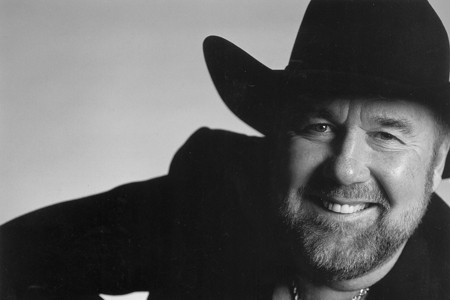

# Johnny Lee

## Artist Profile

American country singer, born July 3, 1946 in Texas City, Texas, USA. He was married to Charlene Tilton from 1982 to 1984.

## Artist Links

- [http://en.wikipedia.org/wiki/Johnny_Lee_(singer)](http://en.wikipedia.org/wiki/Johnny_Lee_(singer))
- [http://www.cmt.com/artists/az/lee_johnny/artist.jhtml](http://www.cmt.com/artists/az/lee_johnny/artist.jhtml)
- [http://www.johnnyleemusic.com](http://www.johnnyleemusic.com)
- [Facebook: Fans Of Johnny Lee](Facebook: Fans Of Johnny Lee)

## See also

- [You Can't Fly Like An Eagle](You_Cant_Fly_Like_An_Eagle.md)
