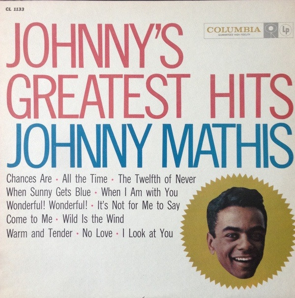

# Johnny's Greatest Hits

By Johnny Mathis

## Album Data

[Discogs URL](https://www.discogs.com/release/4880134-Johnny-Mathis-Johnnys-Greatest-Hits)

- Label: Columbia
- Formats: Vinyl, LP, Compilation, Mono
- Genres: Pop, Vocal, Ballad
- Rating: 3.58
- Released: 1958
- Year: 1958
- Release ID: 4880134
- Media condition: 
- Sleeve condition: 
- Speed: 
- Weight: 
- Notes: 

## Album Tracks

| **Position** | **Title** | **Duration** |
|--------------|-----------|--------------|
| A1 | **Chances Are** |  |
| A2 | **All The Time** |  |
| A3 | **The Twelfth Of Never** |  |
| A4 | **When Sunny Gets Blue** |  |
| A5 | **When I Am With You** |  |
| A6 | **Wonderful! Wonderful!** |  |
| B1 | **It's Not For Me To Say** |  |
| B2 | **Come To Me** |  |
| B3 | **Wild Is The Wind** |  |
| B4 | **Warm And Tender** |  |
| B5 | **No Love (But Your Love)** |  |
| B6 | **Look At You** |  |

## Artist Roles

| **Name** | **Role** |
|----------|----------|
| **Ray Conniff & His Orchestra** | Featuring [With] |
| **Ray Ellis And His Orchestra** | Featuring [With] |
| **Norman Menard** | Photography By |

