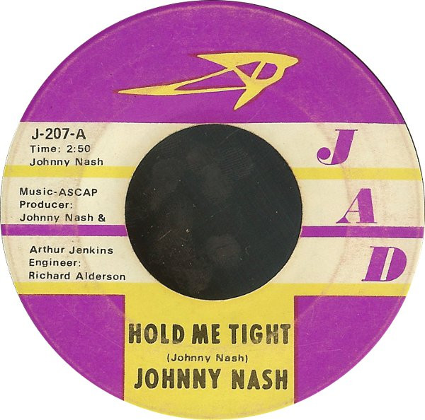

# Hold Me Tight / Cupid

By Johnny Nash

## Album Data

[Discogs URL](https://www.discogs.com/release/1809246-Johnny-Nash-Hold-Me-Tight-Cupid)

- Label: JAD
- Formats: Vinyl, 7", Single, Repress
- Genres: Reggae, Reggae, Rocksteady
- Rating: 4.07
- Released: 1968
- Year: 1968
- Release ID: 1809246
- Media condition: 
- Sleeve condition: 
- Speed: 
- Weight: 
- Notes: 

## Album Tracks

| **Position** | **Title** | **Duration** |
|--------------|-----------|--------------|
| A | **Hold Me Tight** | 2:50 |
| B | **Cupid** | 3:29 |

## Artist Roles

| **Name** | **Role** |
|----------|----------|
| **Arthur Jenkins** | Arranged By |
| **Richard Alderson** | Engineer |
| **Arthur Jenkins** | Producer |
| **Johnny Nash** | Producer |

