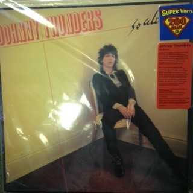

# So Alone

By Johnny Thunders

## Album Data

[Discogs URL](https://www.discogs.com/release/6271785-Johnny-Thunders-So-Alone)

- Label: Drastic Plastic Records
- Formats: Vinyl, LP, Album, Limited Edition, Numbered, Reissue, Remastered
- Genres: Rock, Punk
- Rating: 4.69
- Released: 2014
- Year: 1978
- Release ID: 6271785
- Media condition: 
- Sleeve condition: 
- Speed: 
- Weight: 
- Notes: 

## Album Tracks

| **Position** | **Title** | **Duration** |
|--------------|-----------|--------------|
| A1 | **Pipeline** |  |
| A2 | **You Can't Put Your Arm Round A Memory** |  |
| A3 | **Great Big Kiss** |  |
| A4 | **Ask Me No Questions** |  |
| A5 | **Leave Me Alone** |  |
| B1 | **Daddy Rollin' Stone** |  |
| B2 | **London Boys** |  |
| B3 | **Untouchable** |  |
| B4 | **Subway Train** |  |
| B5 | **Downtown** |  |

## Artist Roles

| **Name** | **Role** |
|----------|----------|
| **Kevin Gray** | Remastered By |

