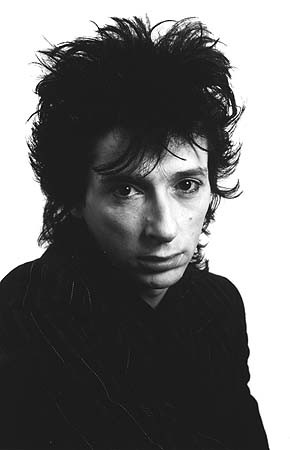

# Johnny Thunders

## Artist Profile

Queens, New York-born guitarist, singer, and songwriter (July 15, 1952 - April 23, 1991) who first came to prominence as lead guitarist for the New York Dolls and later with The Heartbreakers (2).

## Artist Links

- [http://www.thunders.ca](http://www.thunders.ca)
- [https://en.wikipedia.org/wiki/Johnny_Thunders](https://en.wikipedia.org/wiki/Johnny_Thunders)

## See also

- [So Alone](So_Alone.md)
