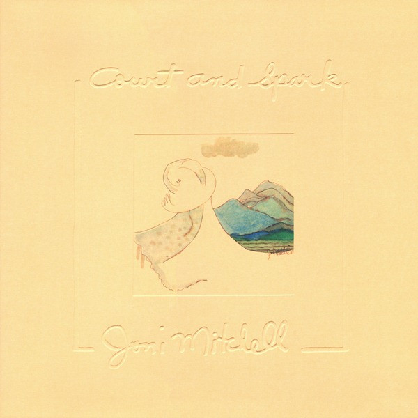

# Court And Spark

By Joni Mitchell

## Album Data

[Discogs URL](https://www.discogs.com/release/2571043-Joni-Mitchell-Court-And-Spark)

- Label: Rhino Vinyl
Asylum Records
- Formats: Vinyl, LP, Album, Reissue, Remastered
- Genres: Jazz, Rock, Soft Rock, Pop Rock, Jazz-Rock
- Rating: 4.63
- Released: 2009
- Year: 1974
- Release ID: 2571043
- Media condition: 
- Sleeve condition: 
- Speed: 
- Weight: 
- Notes: 

## Album Tracks

| **Position** | **Title** | **Duration** |
|--------------|-----------|--------------|
| A1 | **Court And Spark** | 2:46 |
| A2 | **Help Me** | 3:22 |
| A3 | **Free Man In Paris** | 3:02 |
| A4 | **People's Parties** | 2:20 |
| A5 | **The Same Situation** | 3:05 |
| B1 | **Car On A Hill** | 2:58 |
| B2 | **Down To You** | 5:36 |
| B3 | **Just Like This Train** | 4:23 |
| B4 | **Raised On Robbery** | 3:05 |
| B5 | **Trouble Child** | 3:57 |
| B6 | **Twisted** | 2:18 |

## Artist Roles

| **Name** | **Role** |
|----------|----------|
| **Anthony Hudson (2)** | Art Direction, Design |
| **Jim Hughart** | Bass |
| **Max Bennett** | Bass |
| **Wilton Felder** | Bass |
| **Joni Mitchell** | Composed By |
| **John Guerin** | Drums, Percussion |
| **Larry Carlton** | Electric Guitar |
| **Joe Sample** | Electric Piano |
| **Henry Lewy** | Engineer [Sound Engineer] |
| **Chris Bellman** | Lacquer Cut By |
| **Bernie Grundman** | Mastered By [Mastering Engineer] |
| **Joni Mitchell** | Painting [Cover Painting] |
| **Norman Seeff** | Photography By |
| **Joni Mitchell** | Piano |
| **Tom Scott** | Woodwind [Woodwinds], Reeds |

