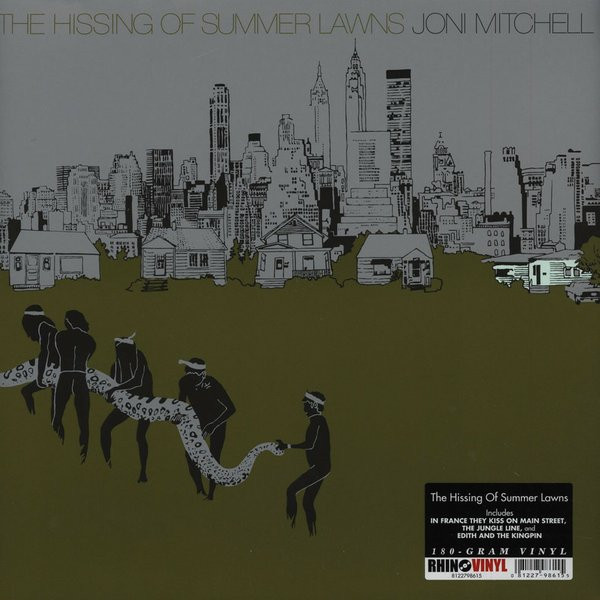

# The Hissing Of Summer Lawns

By Joni Mitchell

## Album Data

[Discogs URL](https://www.discogs.com/release/4422421-Joni-Mitchell-The-Hissing-Of-Summer-Lawns)

- Label: Rhino Records (2)
Asylum Records
- Formats: Vinyl, LP, Album, Reissue
- Genres: Jazz, Rock, Folk, World, & Country, Acoustic, Fusion, Contemporary Jazz
- Rating: 4.52
- Released: 2013
- Year: 1975
- Release ID: 4422421
- Media condition: 
- Sleeve condition: 
- Speed: 
- Weight: 
- Notes: 

## Album Tracks

| **Position** | **Title** | **Duration** |
|--------------|-----------|--------------|
| A1 | **In France They Kiss On Main Street** | 3:17 |
| A2 | **The Jungle Line** | 4:20 |
| A3 | **Edith And The Kingpin** | 3:35 |
| A4 | **Don't Interrupt The Sorrow** | 4:04 |
| A5 | **Shades Of Scarlett Conquering** | 4:57 |
| B1 | **The Hissing Of Summer Lawns** | 3:00 |
| B2 | **The Boho Dance** | 3:56 |
| B3 | **Harry's House / Centerpiece** | 6:52 |
| B4 | **Sweet Bird** | 4:10 |
| B5 | **Shadows And Light** | 4:15 |

## Artist Roles

| **Name** | **Role** |
|----------|----------|
| **Joni Mitchell** | Acoustic Guitar |
| **Max Bennett** | Bass |
| **Wilton Felder** | Bass |
| **John Guerin** | Drums |
| **Larry Carlton** | Electric Guitar |
| **Victor Feldman** | Electric Piano |
| **Ellis Sorkin** | Engineer [Assistant] |
| **Henry Lewy** | Engineer, Mixed By |
| **Bud Shank** | Flute |
| **Chris Bellman** | Lacquer Cut By |
| **Norman Seeff** | Photography By |
| **Joni Mitchell** | Piano |
| **Chuck Findley** | Trumpet |
| **Joni Mitchell** | Vocals, Mixed By, Design, Illustration |
| **Joni Mitchell** | Written-By |

