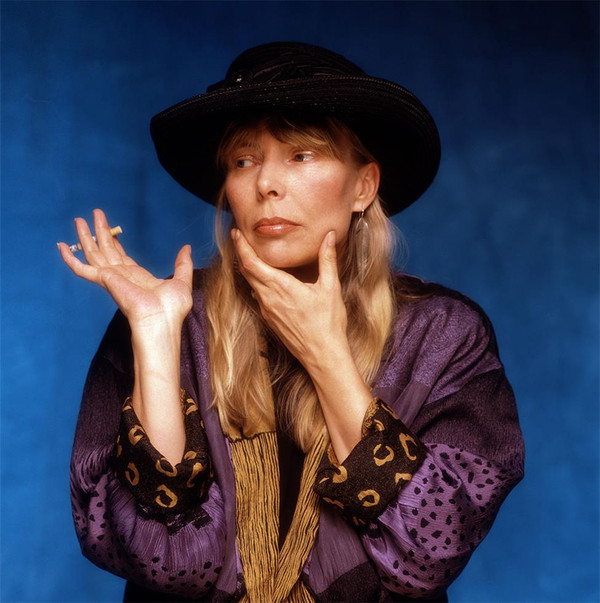

# Joni Mitchell

## Artist Profile

Canadian musician, songwriter, and painter.
Born November 7, 1943, in Fort Macleod, Alberta, Canada.

Inducted into Songwriters Hall of Fame and Rock And Roll Hall of Fame (Performer) in 1997.

Mitchell began singing in small nightclubs in her native Western Canada and then busking on the streets of Toronto. In the mid-1960s she left for New York City and its folk music scene, recording her debut album in 1968 and achieving fame first as a songwriter ("Urge for Going", "Chelsea Morning", "Both Sides, Now", "Woodstock") and then as a singer in her own right. Blue, her starkly personal 1971 album, was voted #30 in Rolling Stone magazine's "500 Greatest Albums of All Time" list of 2003. Mitchell also had pop hits such as "Big Yellow Taxi", "Free Man in Paris", and "Help Me", the last two from 1974's best-selling Court and Spark. In 1965, she married Chuck Mitchell (2) until they divorced in 1968. 

Mitchell's distinctive harmonic guitar style, and piano arrangements all grew more complex through the 1970s as she was deeply influenced by jazz, melding it with pop, folk and rock on experimental albums like 1976's Hejira. She worked closely with jazz greats including Pat Metheny, Wayne Shorter, Jaco Pastorius, Herbie Hancock, and on a 1979 record released after his death, Charles Mingus. From the 1980s on, Mitchell reduced her recording and touring schedule but turned again toward pop, making greater use of synthesizers and direct political protest in her lyrics, which often tackled social and environmental themes alongside romantic and emotional ones.

Mitchell is also a visual artist. She created the artwork for each of her albums, and in 2000 described herself as a "painter derailed by circumstance." Mitchell stopped recording over the last several years, focusing more attention on painting, but in 2007 she released Shine, her first album of new songs in nine years.

See Siquomb Publishing Corp..

## Artist Links

- [https://www.jonimitchell.com/](https://www.jonimitchell.com/)
- [https://www.facebook.com/jonimitchell/](https://www.facebook.com/jonimitchell/)
- [https://twitter.com/JoniMitchell](https://twitter.com/JoniMitchell)
- [https://www.youtube.com/channel/UC1wN41s_8Fmew81Pk2LQOxw](https://www.youtube.com/channel/UC1wN41s_8Fmew81Pk2LQOxw)
- [https://en.wikipedia.org/wiki/Joni_Mitchell](https://en.wikipedia.org/wiki/Joni_Mitchell)
- [https://www.imdb.com/name/nm0593474/](https://www.imdb.com/name/nm0593474/)
- [https://www.rockhall.com/inductees/joni-mitchell](https://www.rockhall.com/inductees/joni-mitchell)

## See also

- [Blue](Blue.md)
- [Court And Spark](Court_And_Spark.md)
- [The Hissing Of Summer Lawns](The_Hissing_Of_Summer_Lawns.md)
