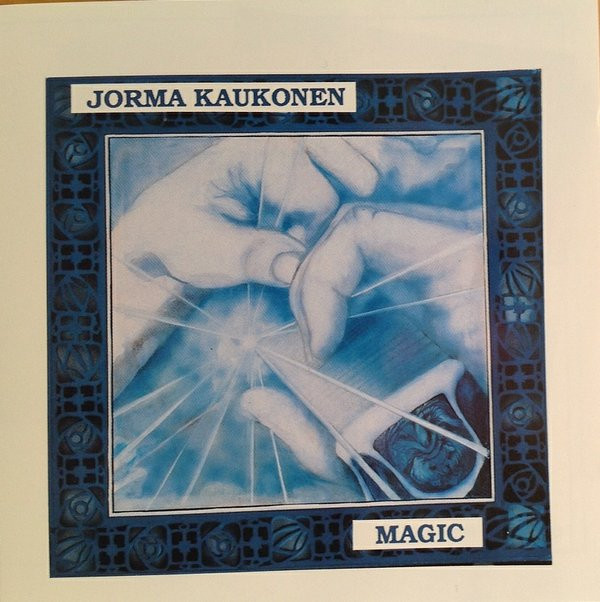

# Magic

By Jorma Kaukonen

## Album Data

[Discogs URL](https://www.discogs.com/release/3610995-Jorma-Kaukonen-Magic)

- Label: Relix Records
- Formats: Vinyl, LP, Album, Stereo
- Genres: Blues
- Rating: 3.94
- Released: 1985
- Year: 1985
- Release ID: 3610995
- Media condition: 
- Sleeve condition: 
- Speed: 
- Weight: 
- Notes: 

## Album Tracks

| **Position** | **Title** | **Duration** |
|--------------|-----------|--------------|
| A1 | **Walkin' Blues** | 3:54 |
| A2 | **Winin' Boy Blues** | 5:42 |
| A3 | **I'll Be Alright Some Day** | 3:27 |
| A4 | **Embryonic Journey** | 2:22 |
| B1 | **Candyman** | 3:05 |
| B2 | **Roads And Roads &** | 5:00 |
| B3 | **Good Shepherd** | 4:19 |
| B4 | **Mann's Fate** | 6:06 |

## Artist Roles

| **Name** | **Role** |
|----------|----------|
| **Maureen Hunter** | Artwork |
| **Brooklyn Bridge Publications** | Layout |
| **Toni A. Brown** | Liner Notes |
| **Leslie D. Kippel** | Producer |

