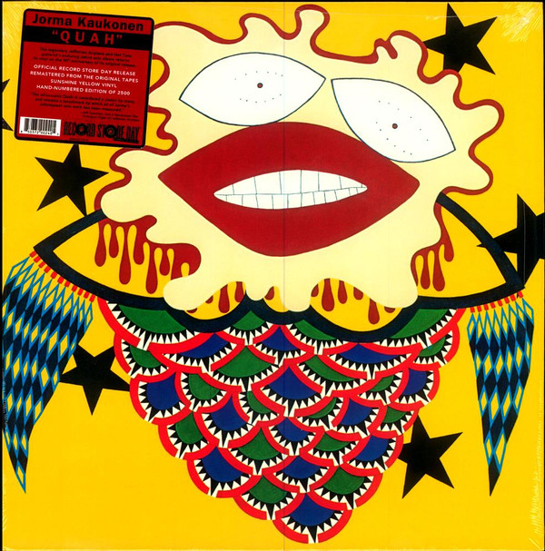

# Quah

By Jorma Kaukonen

## Album Data

[Discogs URL](https://www.discogs.com/release/5611517-Jorma-Kaukonen-With-Tom-Hobson-Quah)

- Label: Brookvale Records
Grunt (3)
- Formats: Vinyl, LP, Album, Numbered, Reissue
- Genres: Rock, Blues, Folk Rock, Acoustic
- Rating: 4.52
- Released: 2014
- Year: 1974
- Release ID: 5611517
- Media condition: 
- Sleeve condition: 
- Speed: 
- Weight: 
- Notes: 

## Album Tracks

| **Position** | **Title** | **Duration** |
|--------------|-----------|--------------|
| A1 | **Genesis** | 4:19 |
| A2 | **I'll Be Alright** | 3:08 |
| A3 | **Song For The North Star** | 2:52 |
| A4 | **I'll Let You Know Before I Leave** | 2:17 |
| A5 | **Flying Clouds** | 4:07 |
| A6 | **Another Man Done Gone** | 2:54 |
| B1 | **I Am The Light Of This World** | 3:46 |
| B2 | **Police Dog Blues** | 3:45 |
| B3 | **Blue Prelude** | 4:05 |
| B4 | **Sweet Hawaiian Sunshine** | 2:42 |
| B5 | **Hamar Promenade** | 4:34 |

## Artist Roles

| **Name** | **Role** |
|----------|----------|
| **Tom Salisbury** | Arranged By [Strings], Conductor |
| **Maurice (50)** | Coordinator [Production Coordinator] |
| **Pat Ieraci** | Coordinator [Production Coordinator] |
| **Margareta Kaukonen** | Cover |
| **Tom Hobson** | Guitar |
| **Jorma Kaukonen** | Guitar, Vocals |
| **Jim Marshall (3)** | Photography By |
| **Jack Casady** | Producer |
| **Mallory Earl** | Recorded By, Mixed By |

