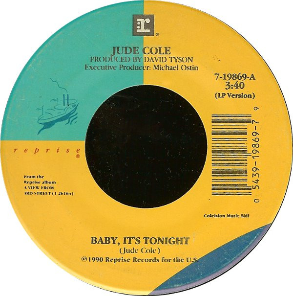

# Baby, It's Tonight

By Jude Cole

## Album Data

[Discogs URL](https://www.discogs.com/release/3095039-Jude-Cole-Baby-Its-Tonight)

- Label: Reprise Records
- Formats: Vinyl, 7", 45 RPM
- Genres: Rock, Pop Rock
- Rating: 4.67
- Released: 1990
- Year: 1990
- Release ID: 3095039
- Media condition: 
- Sleeve condition: 
- Speed: 
- Weight: 
- Notes: 

## Album Tracks

| **Position** | **Title** | **Duration** |
|--------------|-----------|--------------|
| A | **Baby, It's Tonight** | 3:40 |
| B | **Heart Of Blues** | 4:59 |

## Artist Roles

| **Name** | **Role** |
|----------|----------|
| **Michael Ostin** | Executive Producer |
| **David Tyson** | Producer |
| **Jude Cole** | Written-By |

