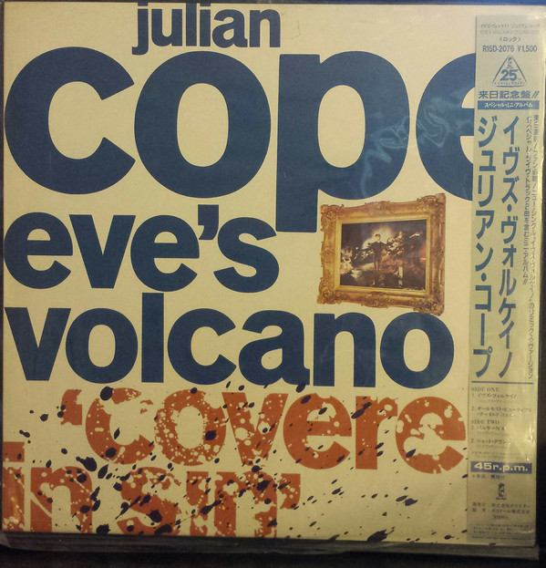

# Eve's Volcano

By Julian Cope

## Album Data

[Discogs URL](https://www.discogs.com/release/9770177-Julian-Cope-Eves-Volcano)

- Label: Island Records
- Formats: Vinyl, 7", 45 RPM, Single
- Genres: Rock, Alternative Rock, New Wave
- Rating: 2
- Released: 1987-04-00
- Year: 1987
- Release ID: 9770177
- Media condition: 
- Sleeve condition: 
- Speed: 
- Weight: 
- Notes: 

## Album Tracks

| **Position** | **Title** | **Duration** |
|--------------|-----------|--------------|
| A | **Eve's Volcano** | 3:50 |
| B | **Almost Beautiful Child** | 5:20 |

## Artist Roles

| **Name** | **Role** |
|----------|----------|
| **Double De Harrison** | Producer |
| **Warne Livesey** | Producer |
| **Tom Lord-Alge** | Remix |

