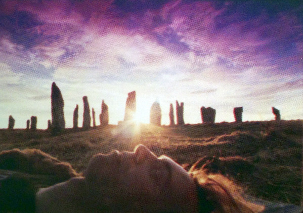

# Julian Cope

## Artist Profile

British vocalist, bassist, songwriter author and poet, born 21 October 1957 in Deri, Monmouthshire, Wales, UK. He grew up in Tamworth (UK) before moving to Liverpool (UK). Now living in Avebury (UK). Father of Avalon Cope. His first band, as bassist, was The Crucial Three, which he co-founded in May 1977 together with Ian McCulloch and Pete Wylie. They disbanded in June 1977. In 1978, he founded the post punk band The Teardrop Explodes with which he gained fame. The band disbanded in late 1982. He moved back to his old home Tamworth (UK) and started recording his first solo album which was released in 1984. He then started to write books, including, amongst others, two books about his own musical career. In 1992 he founded Queen Elizabeth and in 1999 he founded the band Brain Donor, both bands are still going.

## Artist Links

- [http://www.headheritage.co.uk](http://www.headheritage.co.uk)
- [https://www.facebook.com/juliancope12345](https://www.facebook.com/juliancope12345)
- [https://twitter.com/JulianHCope](https://twitter.com/JulianHCope)
- [http://en.wikipedia.org/wiki/Julian_Cope](http://en.wikipedia.org/wiki/Julian_Cope)
- [https://www.imdb.com/name/nm0178557/](https://www.imdb.com/name/nm0178557/)

## See also

- [Eve's Volcano](Eves_Volcano.md)
