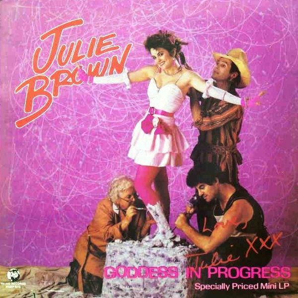

# Goddess In Progress

By Julie Brown

## Album Data

[Discogs URL](https://www.discogs.com/release/521051-Julie-Brown-Goddess-In-Progress)

- Label: Rhino Records (2)
- Formats: Vinyl, LP, Mini-Album
- Genres: Electronic, Pop, Comedy, Synth-pop
- Rating: 3.84
- Released: 1984
- Year: 1984
- Release ID: 521051
- Media condition: 
- Sleeve condition: 
- Speed: 
- Weight: 
- Notes: 

## Album Tracks

| **Position** | **Title** | **Duration** |
|--------------|-----------|--------------|
| A1 | **I Like 'Em Big And Stupid** | 2:39 |
| A2 | **The Homecoming Queen's Got A Gun** | 4:37 |
| B1 | **Will I Make It Through The Eighties?** | 2:20 |
| B2 | **'Cause I'm A Blond** | 2:14 |
| B3 | **Earth Girls Are Easy** | 4:44 |

## Artist Roles

| **Name** | **Role** |
|----------|----------|
| **Leslie Livrano** | Backing Vocals |
| **Linda Lawley** | Backing Vocals |
| **Lorraine Feather** | Backing Vocals |
| **Nancy Bouche** | Backing Vocals |
| **Jeff Steele** | Bass |
| **Kevin McCormack** | Bass |
| **Terrence McNally** | Co-producer |
| **Chuck Berkinshaw** | Drums |
| **Steve Appel** | Drums |
| **Alex Vertikoff** | Engineer |
| **Gary Brandt** | Engineer |
| **Jeffrey Lesser** | Engineer |
| **Mike Hamilton (3)** | Engineer |
| **Steve Thoma** | Engineer |
| **Craig Hull** | Guitar |
| **Danny Grenier** | Guitar |
| **Sterling Smith** | Keyboards, Synthesizer |
| **Steve Thoma** | Keyboards, Synthesizer |
| **Carol Hibbs** | Mastered By |
| **Robert Nease** | Photography By [Cover] |
| **Dan Lawson** | Producer |
| **Steve Thoma** | Producer |
| **Chris Mostert** | Saxophone |
| **Charlie Coffey** | Written-By |
| **Julie Brown** | Written-By |
| **Ray Colcord** | Written-By |
| **Terrence McNally** | Written-By |

